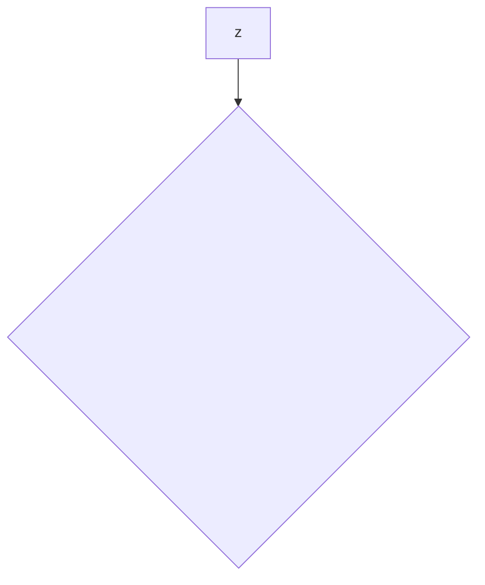

=== Content from github.com_a2e5cc13_20250121_001733.html ===

[Skip to content](#start-of-content)

## Navigation Menu

Toggle navigation

[Sign in](/login?return_to=https%3A%2F%2Fgithub.com%2Fcure53%2FDOMPurify%2Fcommit%2F4e8af7b2c4a159b683d317e02c5cbddb86dc4a0e)

* Product

  + [GitHub Copilot
    Write better code with AI](https://github.com/features/copilot)
  + [Security
    Find and fix vulnerabilities](https://github.com/features/security)
  + [Actions
    Automate any workflow](https://github.com/features/actions)
  + [Codespaces
    Instant dev environments](https://github.com/features/codespaces)
  + [Issues
    Plan and track work](https://github.com/features/issues)
  + [Code Review
    Manage code changes](https://github.com/features/code-review)
  + [Discussions
    Collaborate outside of code](https://github.com/features/discussions)
  + [Code Search
    Find more, search less](https://github.com/features/code-search)

  Explore
  + [All features](https://github.com/features)
  + [Documentation](https://docs.github.com)
  + [GitHub Skills](https://skills.github.com)
  + [Blog](https://github.blog)
* Solutions

  By company size
  + [Enterprises](https://github.com/enterprise)
  + [Small and medium teams](https://github.com/team)
  + [Startups](https://github.com/enterprise/startups)
  + [Nonprofits](/solutions/industry/nonprofits)
  By use case
  + [DevSecOps](/solutions/use-case/devsecops)
  + [DevOps](/solutions/use-case/devops)
  + [CI/CD](/solutions/use-case/ci-cd)
  + [View all use cases](/solutions/use-case)

  By industry
  + [Healthcare](/solutions/industry/healthcare)
  + [Financial services](/solutions/industry/financial-services)
  + [Manufacturing](/solutions/industry/manufacturing)
  + [Government](/solutions/industry/government)
  + [View all industries](/solutions/industry)

  [View all solutions](/solutions)
* Resources

  Topics
  + [AI](/resources/articles/ai)
  + [DevOps](/resources/articles/devops)
  + [Security](/resources/articles/security)
  + [Software Development](/resources/articles/software-development)
  + [View all](/resources/articles)

  Explore
  + [Learning Pathways](https://resources.github.com/learn/pathways)
  + [White papers, Ebooks, Webinars](https://resources.github.com)
  + [Customer Stories](https://github.com/customer-stories)
  + [Partners](https://partner.github.com)
  + [Executive Insights](https://github.com/solutions/executive-insights)
* Open Source

  + [GitHub Sponsors
    Fund open source developers](/sponsors)
  + [The ReadME Project
    GitHub community articles](https://github.com/readme)
  Repositories
  + [Topics](https://github.com/topics)
  + [Trending](https://github.com/trending)
  + [Collections](https://github.com/collections)
* Enterprise

  + [Enterprise platform
    AI-powered developer platform](/enterprise)
  Available add-ons
  + [Advanced Security
    Enterprise-grade security features](https://github.com/enterprise/advanced-security)
  + [GitHub Copilot
    Enterprise-grade AI features](/features/copilot#enterprise)
  + [Premium Support
    Enterprise-grade 24/7 support](/premium-support)
* [Pricing](https://github.com/pricing)

Search or jump to...

# Search code, repositories, users, issues, pull requests...

Search

Clear

[Search syntax tips](https://docs.github.com/search-github/github-code-search/understanding-github-code-search-syntax)

# Provide feedback

We read every piece of feedback, and take your input very seriously.

Include my email address so I can be contacted

  Cancel

 Submit feedback

# Saved searches

## Use saved searches to filter your results more quickly

Name

Query

To see all available qualifiers, see our [documentation](https://docs.github.com/search-github/github-code-search/understanding-github-code-search-syntax).

  Cancel

 Create saved search

[Sign in](/login?return_to=https%3A%2F%2Fgithub.com%2Fcure53%2FDOMPurify%2Fcommit%2F4e8af7b2c4a159b683d317e02c5cbddb86dc4a0e)

[Sign up](/signup?ref_cta=Sign+up&ref_loc=header+logged+out&ref_page=%2F%3Cuser-name%3E%2F%3Crepo-name%3E%2Fvoltron%2Fcommit_fragments%2Frepo_layout&source=header-repo&source_repo=cure53%2FDOMPurify)
Reseting focus

You signed in with another tab or window. Reload to refresh your session.
You signed out in another tab or window. Reload to refresh your session.
You switched accounts on another tab or window. Reload to refresh your session.

Dismiss alert

{{ message }}

[cure53](/cure53)
/
**[DOMPurify](/cure53/DOMPurify)**
Public

* [Notifications](/login?return_to=%2Fcure53%2FDOMPurify) You must be signed in to change notification settings
* [Fork
  750](/login?return_to=%2Fcure53%2FDOMPurify)
* [Star
   14.4k](/login?return_to=%2Fcure53%2FDOMPurify)

* [Code](/cure53/DOMPurify)
* [Issues
  0](/cure53/DOMPurify/issues)
* [Pull requests
  0](/cure53/DOMPurify/pulls)
* [Actions](/cure53/DOMPurify/actions)
* [Projects
  0](/cure53/DOMPurify/projects)
* [Wiki](/cure53/DOMPurify/wiki)
* [Security](/cure53/DOMPurify/security)
* [Insights](/cure53/DOMPurify/pulse)

Additional navigation options

* [Code](/cure53/DOMPurify)
* [Issues](/cure53/DOMPurify/issues)
* [Pull requests](/cure53/DOMPurify/pulls)
* [Actions](/cure53/DOMPurify/actions)
* [Projects](/cure53/DOMPurify/projects)
* [Wiki](/cure53/DOMPurify/wiki)
* [Security](/cure53/DOMPurify/security)
* [Insights](/cure53/DOMPurify/pulse)

## Commit

[Permalink](/cure53/DOMPurify/commit/4e8af7b2c4a159b683d317e02c5cbddb86dc4a0e)

This commit does not belong to any branch on this repository, and may belong to a fork outside of the repository.

Added better check for attribute based mXSS

[Browse files](/cure53/DOMPurify/tree/4e8af7b2c4a159b683d317e02c5cbddb86dc4a0e)
Browse the repository at this point in the history

* Loading branch information

[](/cure53)

[cure53](/cure53/DOMPurify/commits?author=cure53 "View all commits by cure53")
committed
Oct 14, 2019

1 parent
[7840170](/cure53/DOMPurify/commit/78401705222c4e60d3fe41bf9c3fdd55f791e370)

commit 4e8af7b

 Show file tree

 Hide file tree

Showing
**10 changed files**
with
**47 additions**
and
**11 deletions**.

* Whitespace
* Ignore whitespace

* Split
* Unified

* dist

  + dist/purify.cjs.js
    [purify.cjs.js](#diff-48108d9bf161db3408a0fc8e8f7ab693247d39db9998ff4cd0d9c3de233dd09a)
  + dist/purify.cjs.js.map
    [purify.cjs.js.map](#diff-342a34c4130481683ae4f1668de8b485257affb70c2b6778bf42439c255112dc)
  + dist/purify.es.js
    [purify.es.js](#diff-b0377c258ec41bfd2bf1a8a0095ac537cab765327272d5195fc41e247fd10d6c)
  + dist/purify.es.js.map
    [purify.es.js.map](#diff-fb0be688d3a84de60a9ac28620c4de420c5d6282492a66721235546609e61bac)
  + dist/purify.js
    [purify.js](#diff-ab3a738ed8f398d630832324fcb9ff05e058c934b183fa3bb257b266802dc86c)
  + dist/purify.js.map
    [purify.js.map](#diff-0789ba6b8c289c880c1720fba3a81399e9a24759f0cabdc007b0be18be63e455)
  + dist/purify.min.js
    [purify.min.js](#diff-14fa88ed61f6d0dfd6ecaf0ad94bdf943104b1d0f1421ddf65743425f4ec09bc)
  + dist/purify.min.js.map
    [purify.min.js.map](#diff-c5305d1de45eb9d6d929647ece59e8245cd8809643ee1bff4f4fe2ca1c41dee5)
* src

  + src/purify.js
    [purify.js](#diff-ac7cd96b8f4b994868af43ac8aff25573dd7cede1aab33fdcfd438811c7e853d)
* test/fixtures

  + test/fixtures/expect.js
    [expect.js](#diff-78ef4edefc9917fba8e52d27c2c1664635265032051aae2db2164439466ac07a)

## There are no files selected for viewing

7 changes: 6 additions & 1 deletion

7
[dist/purify.cjs.js](#diff-48108d9bf161db3408a0fc8e8f7ab693247d39db9998ff4cd0d9c3de233dd09a "dist/purify.cjs.js")

Show comments

[View file](/cure53/DOMPurify/blob/4e8af7b2c4a159b683d317e02c5cbddb86dc4a0e/dist/purify.cjs.js)
Edit file

Delete file

Load diff

Some generated files are not rendered by default. Learn more about [how customized files appear on GitHub](https://docs.github.com/github/administering-a-repository/customizing-how-changed-files-appear-on-github).

Oops, something went wrong.

Retry

2 changes: 1 addition & 1 deletion

2
[dist/purify.cjs.js.map](#diff-342a34c4130481683ae4f1668de8b485257affb70c2b6778bf42439c255112dc "dist/purify.cjs.js.map")

Show comments

[View file](/cure53/DOMPurify/blob/4e8af7b2c4a159b683d317e02c5cbddb86dc4a0e/dist/purify.cjs.js.map)
Edit file

Delete file

Load diff

Large diffs are not rendered by default.

Oops, something went wrong.

Retry

7 changes: 6 additions & 1 deletion

7
[dist/purify.es.js](#diff-b0377c258ec41bfd2bf1a8a0095ac537cab765327272d5195fc41e247fd10d6c "dist/purify.es.js")

Show comments

[View file](/cure53/DOMPurify/blob/4e8af7b2c4a159b683d317e02c5cbddb86dc4a0e/dist/purify.es.js)
Edit file

Delete file

Load diff

Some generated files are not rendered by default. Learn more about [how customized files appear on GitHub](https://docs.github.com/github/administering-a-repository/customizing-how-changed-files-appear-on-github).

Oops, something went wrong.

Retry

2 changes: 1 addition & 1 deletion

2
[dist/purify.es.js.map](#diff-fb0be688d3a84de60a9ac28620c4de420c5d6282492a66721235546609e61bac "dist/purify.es.js.map")

Show comments

[View file](/cure53/DOMPurify/blob/4e8af7b2c4a159b683d317e02c5cbddb86dc4a0e/dist/purify.es.js.map)
Edit file

Delete file

Load diff

Large diffs are not rendered by default.

Oops, something went wrong.

Retry

7 changes: 6 additions & 1 deletion

7
[dist/purify.js](#diff-ab3a738ed8f398d630832324fcb9ff05e058c934b183fa3bb257b266802dc86c "dist/purify.js")

Show comments

[View file](/cure53/DOMPurify/blob/4e8af7b2c4a159b683d317e02c5cbddb86dc4a0e/dist/purify.js)
Edit file

Delete file

Load diff

Some generated files are not rendered by default. Learn more about [how customized files appear on GitHub](https://docs.github.com/github/administering-a-repository/customizing-how-changed-files-appear-on-github).

Oops, something went wrong.

Retry

2 changes: 1 addition & 1 deletion

2
[dist/purify.js.map](#diff-0789ba6b8c289c880c1720fba3a81399e9a24759f0cabdc007b0be18be63e455 "dist/purify.js.map")

Show comments

[View file](/cure53/DOMPurify/blob/4e8af7b2c4a159b683d317e02c5cbddb86dc4a0e/dist/purify.js.map)
Edit file

Delete file

Load diff

Large diffs are not rendered by default.

Oops, something went wrong.

Retry

2 changes: 1 addition & 1 deletion

2
[dist/purify.min.js](#diff-14fa88ed61f6d0dfd6ecaf0ad94bdf943104b1d0f1421ddf65743425f4ec09bc "dist/purify.min.js")

Show comments

[View file](/cure53/DOMPurify/blob/4e8af7b2c4a159b683d317e02c5cbddb86dc4a0e/dist/purify.min.js)
Edit file

Delete file

Load diff

Large diffs are not rendered by default.

Oops, something went wrong.

Retry

2 changes: 1 addition & 1 deletion

2
[dist/purify.min.js.map](#diff-c5305d1de45eb9d6d929647ece59e8245cd8809643ee1bff4f4fe2ca1c41dee5 "dist/purify.min.js.map")

Show comments

[View file](/cure53/DOMPurify/blob/4e8af7b2c4a159b683d317e02c5cbddb86dc4a0e/dist/purify.min.js.map)
Edit file

Delete file

Load diff

Large diffs are not rendered by default.

Oops, something went wrong.

Retry

6 changes: 6 additions & 0 deletions

6
[src/purify.js](#diff-ac7cd96b8f4b994868af43ac8aff25573dd7cede1aab33fdcfd438811c7e853d "src/purify.js")

Show comments

[View file](/cure53/DOMPurify/blob/4e8af7b2c4a159b683d317e02c5cbddb86dc4a0e/src/purify.js)
Edit file

Delete file

This file contains bidirectional Unicode text that may be interpreted or compiled differently than what appears below. To review, open the file in an editor that reveals hidden Unicode characters.
[Learn more about bidirectional Unicode characters](https://github.co/hiddenchars)

  [Show hidden characters](%7B%7B%20revealButtonHref%20%7D%7D)

| Original file line number | Diff line number | Diff line change |
| --- | --- | --- |
| Expand Up | | @@ -260,6 +260,7 @@ function createDOMPurify(window = getGlobal()) { |
|  |  | 'title', |
|  |  | 'svg', |
|  |  | 'video', |
|  |  | 'xmp', |
|  |  | ]); |
|  |  |  |
|  |  | /\* Tags that are safe for data: URIs \*/ |
| Expand Down  Expand Up | | @@ -893,6 +894,11 @@ function createDOMPurify(window = getGlobal()) { |
|  |  | continue; |
|  |  | } |
|  |  |  |
|  |  | /\* Take care of an mXSS pattern using namespace switches \*/ |
|  |  | if (/<\/(style|textarea)/.test(value)) { |
|  |  | \_removeAttribute(name, currentNode); |
|  |  | } |
|  |  |  |
|  |  | /\* Sanitize attribute content to be template-safe \*/ |
|  |  | if (SAFE\_FOR\_TEMPLATES) { |
|  |  | value = value.replace(MUSTACHE\_EXPR, ' '); |
| Expand Down | |  |

21 changes: 18 additions & 3 deletions

21
[test/fixtures/expect.js](#diff-78ef4edefc9917fba8e52d27c2c1664635265032051aae2db2164439466ac07a "test/fixtures/expect.js")

Show comments

[View file](/cure53/DOMPurify/blob/4e8af7b2c4a159b683d317e02c5cbddb86dc4a0e/test/fixtures/expect.js)
Edit file

Delete file

This file contains bidirectional Unicode text that may be interpreted or compiled differently than what appears below. To review, open the file in an editor that reveals hidden Unicode characters.
[Learn more about bidirectional Unicode characters](https://github.co/hiddenchars)

  [Show hidden characters](%7B%7B%20revealButtonHref%20%7D%7D)

| Original file line number | Diff line number | Diff line change |
| --- | --- | --- |
| Expand Up | | @@ -206,7 +206,8 @@ module.exports = [ |
|  |  | "payload": "<option><iframe></select><b><script>alert(1)</script>", |
|  |  | "expected": [ |
|  |  | "<option><b></b></option>", |
|  |  | "<option>&lt;/select&gt;&lt;b&gt;&lt;script&gt;alert(1)&lt;/script&gt;</option>" |
|  |  | "<option>&lt;/select&gt;&lt;b&gt;&lt;script&gt;alert(1)&lt;/script&gt;</option>", |
|  |  | "<option></option>" |
|  |  | ] |
|  |  | }, { |
|  |  | "title": "Closing Iframe and option", |
| Expand Down  Expand Up | | @@ -834,7 +835,8 @@ module.exports = [ |
|  |  | "payload": "<div id=\"121\"><html xmlns=\"http://www.w3.org/1999/xhtml\"\nxmlns:svg=\"http://www.w3.org/2000/svg\">\n<body style=\"background:gray\">\n<iframe src=\"http://example.com/\" style=\"width:800px; height:350px; border:none; mask: url(#maskForClickjacking);\"/>\n<svg:svg>\n<svg:mask id=\"maskForClickjacking\" maskUnits=\"objectBoundingBox\" maskContentUnits=\"objectBoundingBox\">\n <svg:rect x=\"0.0\" y=\"0.0\" width=\"0.373\" height=\"0.3\" fill=\"white\"/>\n <svg:circle cx=\"0.45\" cy=\"0.7\" r=\"0.075\" fill=\"white\"/>\n</svg:mask>\n</svg:svg>\n</body>\n</html>//[\"'`-->]]>]</div>", |
|  |  | "expected": [ |
|  |  | "<div id=\"121\">\n\n\n\n\n \n \n\n\n\n//[\"'`--&gt;]]&gt;]</div>", |
|  |  | "<div id=\"121\">\n\n\n&lt;svg:svg&gt;\n&lt;svg:mask id=\"maskForClickjacking\" maskUnits=\"objectBoundingBox\" maskContentUnits=\"objectBoundingBox\"&gt;\n &lt;svg:rect x=\"0.0\" y=\"0.0\" width=\"0.373\" height=\"0.3\" fill=\"white\"/&gt;\n &lt;svg:circle cx=\"0.45\" cy=\"0.7\" r=\"0.075\" fill=\"white\"/&gt;\n&lt;/svg:mask&gt;\n&lt;/svg:svg&gt;\n&lt;/body&gt;\n&lt;/html&gt;//[\"'`--&gt;]]&gt;]&lt;/div&gt;</div>" |
|  |  | "<div id=\"121\">\n\n\n&lt;svg:svg&gt;\n&lt;svg:mask id=\"maskForClickjacking\" maskUnits=\"objectBoundingBox\" maskContentUnits=\"objectBoundingBox\"&gt;\n &lt;svg:rect x=\"0.0\" y=\"0.0\" width=\"0.373\" height=\"0.3\" fill=\"white\"/&gt;\n &lt;svg:circle cx=\"0.45\" cy=\"0.7\" r=\"0.075\" fill=\"white\"/&gt;\n&lt;/svg:mask&gt;\n&lt;/svg:svg&gt;\n&lt;/body&gt;\n&lt;/html&gt;//[\"'`--&gt;]]&gt;]&lt;/div&gt;</div>", |
|  |  | "<div id=\"121\">\n\n</div>" |
|  |  | ] |
|  |  | }, { |
|  |  | "title": "iframe (sandboxed)", |
| Expand Down  Expand Up | | @@ -926,7 +928,8 @@ module.exports = [ |
|  |  | "expected": [ |
|  |  | "<div id=\"134\">\n&lt;%\n\n</xmp>\n\n %&gt;/\nalert(2)\n\n\nXXX\n<style>\n\*['<!--']{}\n</style>\n--&gt;{}\n\*{color:red}//[\"'`--&gt;]]&gt;]</div>", |
|  |  | "<div id=\"134\">\n&lt;%\n\n\n\n %&gt;/\nalert(2)\n\n\nXXX\n<style>\n\*['<!--']{}\n</style>\n--&gt;{}\n\*{color:red}//[\"'`--&gt;]]&gt;]</div>", |
|  |  | "<div id=\"134\">\n&lt;%\n\n\n\n %&gt;/\nalert(2)\n\n\nXXX\n<style>\n\*['<!--']{}\n</style>\n--&gt;{}\n\*{color:red}//[\"'`--&gt;]]&gt;]</div>" |
|  |  | "<div id=\"134\">\n&lt;%\n\n\n\n %&gt;/\nalert(2)\n\n\nXXX\n<style>\n\*['<!--']{}\n</style>\n--&gt;{}\n\*{color:red}//[\"'`--&gt;]]&gt;]</div>", |
|  |  | "<div id=\"134\">\n</xmp>\n\n %&gt;/\nalert(2)\n\n\nXXX\n<style>\n\*['<!--']{}\n</style>\n--&gt;{}\n\*{color:red}//[\"'`--&gt;]]&gt;]</div>" |
|  |  | ] |
|  |  | }, { |
|  |  | "title": "SVG", |
| Expand Down  Expand Up | | @@ -1053,5 +1056,17 @@ module.exports = [ |
|  |  | "expected": [ |
|  |  | "" |
|  |  | ] |
|  |  | }, { |
|  |  | "title": "Tests against removal-based mXSS behavior 1/2", |
|  |  | "payload": "<xmp><svg><b><style><b title='</style>'>", |
|  |  | "expected": [ |
|  |  | "" |
|  |  | ] |
|  |  | }, { |
|  |  | "title": "Tests against removal-based mXSS behavior 2/2", |
|  |  | "payload": "<noembed><svg><b><style><b title='</style>'>", |
|  |  | "expected": [ |
|  |  | "" |
|  |  | ] |
|  |  | } |
|  |  | ]; |

Toggle all file notes
Toggle all file annotations

### 0 comments on commit `4e8af7b`

Please
[sign in](/login?return_to=https%3A%2F%2Fgithub.com%2Fcure53%2FDOMPurify%2Fcommit%2F4e8af7b2c4a159b683d317e02c5cbddb86dc4a0e) to comment.

## Footer

© 2025 GitHub, Inc.

### Footer navigation

* [Terms](https://docs.github.com/site-policy/github-terms/github-terms-of-service)
* [Privacy](https://docs.github.com/site-policy/privacy-policies/github-privacy-statement)
* [Security](https://github.com/security)
* [Status](https://www.githubstatus.com/)
* [Docs](https://docs.github.com/)
* [Contact](https://support.github.com?tags=dotcom-footer)
* Manage cookies
* Do not share my personal information

You can’t perform that action at this time.


=== Content from github.com_ecdce85c_20250121_001733.html ===

[Skip to content](#start-of-content)

## Navigation Menu

Toggle navigation

[Sign in](/login?return_to=https%3A%2F%2Fgithub.com%2Ftypora%2Ftypora-issues%2Fissues%2F3124)

* Product

  + [GitHub Copilot
    Write better code with AI](https://github.com/features/copilot)
  + [Security
    Find and fix vulnerabilities](https://github.com/features/security)
  + [Actions
    Automate any workflow](https://github.com/features/actions)
  + [Codespaces
    Instant dev environments](https://github.com/features/codespaces)
  + [Issues
    Plan and track work](https://github.com/features/issues)
  + [Code Review
    Manage code changes](https://github.com/features/code-review)
  + [Discussions
    Collaborate outside of code](https://github.com/features/discussions)
  + [Code Search
    Find more, search less](https://github.com/features/code-search)

  Explore
  + [All features](https://github.com/features)
  + [Documentation](https://docs.github.com)
  + [GitHub Skills](https://skills.github.com)
  + [Blog](https://github.blog)
* Solutions

  By company size
  + [Enterprises](https://github.com/enterprise)
  + [Small and medium teams](https://github.com/team)
  + [Startups](https://github.com/enterprise/startups)
  + [Nonprofits](/solutions/industry/nonprofits)
  By use case
  + [DevSecOps](/solutions/use-case/devsecops)
  + [DevOps](/solutions/use-case/devops)
  + [CI/CD](/solutions/use-case/ci-cd)
  + [View all use cases](/solutions/use-case)

  By industry
  + [Healthcare](/solutions/industry/healthcare)
  + [Financial services](/solutions/industry/financial-services)
  + [Manufacturing](/solutions/industry/manufacturing)
  + [Government](/solutions/industry/government)
  + [View all industries](/solutions/industry)

  [View all solutions](/solutions)
* Resources

  Topics
  + [AI](/resources/articles/ai)
  + [DevOps](/resources/articles/devops)
  + [Security](/resources/articles/security)
  + [Software Development](/resources/articles/software-development)
  + [View all](/resources/articles)

  Explore
  + [Learning Pathways](https://resources.github.com/learn/pathways)
  + [White papers, Ebooks, Webinars](https://resources.github.com)
  + [Customer Stories](https://github.com/customer-stories)
  + [Partners](https://partner.github.com)
  + [Executive Insights](https://github.com/solutions/executive-insights)
* Open Source

  + [GitHub Sponsors
    Fund open source developers](/sponsors)
  + [The ReadME Project
    GitHub community articles](https://github.com/readme)
  Repositories
  + [Topics](https://github.com/topics)
  + [Trending](https://github.com/trending)
  + [Collections](https://github.com/collections)
* Enterprise

  + [Enterprise platform
    AI-powered developer platform](/enterprise)
  Available add-ons
  + [Advanced Security
    Enterprise-grade security features](https://github.com/enterprise/advanced-security)
  + [GitHub Copilot
    Enterprise-grade AI features](/features/copilot#enterprise)
  + [Premium Support
    Enterprise-grade 24/7 support](/premium-support)
* [Pricing](https://github.com/pricing)

Search or jump to...

# Search code, repositories, users, issues, pull requests...

Search

Clear

[Search syntax tips](https://docs.github.com/search-github/github-code-search/understanding-github-code-search-syntax)

# Provide feedback

We read every piece of feedback, and take your input very seriously.

Include my email address so I can be contacted

  Cancel

 Submit feedback

# Saved searches

## Use saved searches to filter your results more quickly

Name

Query

To see all available qualifiers, see our [documentation](https://docs.github.com/search-github/github-code-search/understanding-github-code-search-syntax).

  Cancel

 Create saved search

[Sign in](/login?return_to=https%3A%2F%2Fgithub.com%2Ftypora%2Ftypora-issues%2Fissues%2F3124)

[Sign up](/signup?ref_cta=Sign+up&ref_loc=header+logged+out&ref_page=%2F%3Cuser-name%3E%2F%3Crepo-name%3E%2Fvoltron%2Fissues_fragments%2Fissue_layout&source=header-repo&source_repo=typora%2Ftypora-issues)
Reseting focus

You signed in with another tab or window. Reload to refresh your session.
You signed out in another tab or window. Reload to refresh your session.
You switched accounts on another tab or window. Reload to refresh your session.

Dismiss alert

{{ message }}

[typora](/typora)
/
**[typora-issues](/typora/typora-issues)**
Public

* [Notifications](/login?return_to=%2Ftypora%2Ftypora-issues) You must be signed in to change notification settings
* [Fork
  56](/login?return_to=%2Ftypora%2Ftypora-issues)
* [Star
   1.5k](/login?return_to=%2Ftypora%2Ftypora-issues)

* [Code](/typora/typora-issues)
* [Issues
  801](/typora/typora-issues/issues)
* [Pull requests
  0](/typora/typora-issues/pulls)
* [Actions](/typora/typora-issues/actions)
* [Projects
  0](/typora/typora-issues/projects)
* [Wiki](/typora/typora-issues/wiki)
* [Security](/typora/typora-issues/security)
* [Insights](/typora/typora-issues/pulse)

Additional navigation options

* [Code](/typora/typora-issues)
* [Issues](/typora/typora-issues/issues)
* [Pull requests](/typora/typora-issues/pulls)
* [Actions](/typora/typora-issues/actions)
* [Projects](/typora/typora-issues/projects)
* [Wiki](/typora/typora-issues/wiki)
* [Security](/typora/typora-issues/security)
* [Insights](/typora/typora-issues/pulse)

# Typora RCE via mXSS #3124

[New issue](/login?return_to=)[Jump to bottom](#comment-composer-heading)Copy link[New issue](/login?return_to=)[Jump to bottom](#comment-composer-heading)Copy linkClosedClosed[Typora RCE via mXSS](#top)#3124Copy linkLabels[3rd party](https://github.com/typora/typora-issues/issues?q=state%3Aopen%20label%3A%223rd%20party%22)[bug](https://github.com/typora/typora-issues/issues?q=state%3Aopen%20label%3A%22bug%22)
## Description

[0xBADCA7](https://github.com/0xBADCA7)opened [on Dec 27, 2019](https://github.com/typora/typora-issues/issues/3124#issue-543010305)
# Summary

A mXSS in Typora leads to remote code execution. The vector is Mermaid code blocks (HTML labels) however other spots where Typora attempts to clean up HTML using DOMPurify could be prone to the same.

# Steps to reproduce / PoC

1. Create an .md with the following contents:

```


```

2. Open the file in Typora
3. Witness a calculator pop up:

[](https://user-images.githubusercontent.com/6436336/71534382-8c87f980-2952-11ea-941d-40f0bdb6d42d.gif)

The payload is simply HTML-entity-encoded

```
<svg></p><style><g title=</style>}
```

where the JS is simply:

```
try{var r=reqnode('child_process');r.execFile('/usr/bin/gnome-calculator')||r.execFile('calc.exe')}catch{window.bridge.callHandler('window.open', 'file:///System/Applications/Calculator.app/Contents/MacOS/Calculator')};
```
# Fix

It's perhaps best to upgrade [DOMPurify](https://github.com/cure53/DOMPurify) to the [latest version](https://github.com/cure53/DOMPurify/releases/latest) which seems to address new mutation XSS vectors. It looks like the version that's shipped with Typora is somewhat old (1.0.4).

Consider employing [Content-Security Policy](https://developer.mozilla.org/en-US/docs/Web/HTTP/CSP) for a broader mitigation. It appears that RCE via XSS emerges as a pattern among Typora's issues. Implementing a fine-tuned CSP is time consuming but building a good policy step by step could prove worthy in the long run and cover users even when new XSS vectors are discovered.

# Notes

Versions known to be vulnerable and tested are 0.9.81, 0.9.9.31.2 (3946). These are the latest downloads from the website (for Linux and MacOS respectively). I did not test the Windows version of the app.

# CVSS 8.3

My take is [CVSS:3.0/AV:N/AC:H/PR:N/UI:R/S:C/C:H/I:H/A:H](https://nvd.nist.gov/vuln-metrics/cvss/v3-calculator?vector=AV:N/AC:H/PR:N/UI:R/S:C/C:H/I:H/A:H&version=3.1)

// Mark Art at Havoc Research

👍1
## Metadata

### Assignees

No one assigned

### Labels

[3rd party](https://github.com/typora/typora-issues/issues?q=state%3Aopen%20label%3A%223rd%20party%22)[bug](https://github.com/typora/typora-issues/issues?q=state%3Aopen%20label%3A%22bug%22)
### Type

No type
### Projects

No projects
### Milestone

No milestone

### Relationships

None yet
### Development

No branches or pull requests
## Issue actions

## Footer

© 2025 GitHub, Inc.

### Footer navigation

* [Terms](https://docs.github.com/site-policy/github-terms/github-terms-of-service)
* [Privacy](https://docs.github.com/site-policy/privacy-policies/github-privacy-statement)
* [Security](https://github.com/security)
* [Status](https://www.githubstatus.com/)
* [Docs](https://docs.github.com/)
* [Contact](https://support.github.com?tags=dotcom-footer)
* Manage cookies
* Do not share my personal information

You can’t perform that action at this time.


