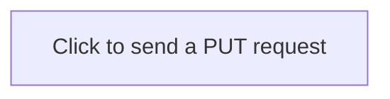

=== Content from gitlab.com_d9b07e59_20250119_115655.html ===


[Skip to content](#content-body)
GitLab
[Next](https://next.gitlab.com)

* Menu

  + [Why GitLab](https://about.gitlab.com/why-gitlab)
  + [Pricing](https://about.gitlab.com/pricing)
  + [Contact Sales](https://about.gitlab.com/sales)
  + [Explore](/explore)
* [Why GitLab](https://about.gitlab.com/why-gitlab)
* [Pricing](https://about.gitlab.com/pricing)
* [Contact Sales](https://about.gitlab.com/sales)
* [Explore](/explore)

* [Sign in](/users/sign_in?redirect_to_referer=yes)
* [Get free trial](/users/sign_up)

# Send arbitrary PUT requests when user clicks on a link

**[HackerOne report #824689](https://hackerone.com/reports/824689)** by `yvvdwf` on 2020-03-19, assigned to [@jeremymatos](/jeremymatos "Jeremy Matos"):

Dear teams,

### Summary

Mermaid allows users to set class name of a block. This ability becomes vulnerable in Gitlab issues because of [issue.js#L90](https://gitlab.com/gitlab-org/gitlab/-/blob/master/app/assets/javascripts/issue.js#L90):

```
    return $(document).on(
      'click',
      '.js-issuable-actions a.btn-close, .js-issuable-actions a.btn-reopen',
      e => {
...
       const $button = $(e.currentTarget);
...
        const url = $button.attr('href');
        return axios
          .put(url)
          .then(({ data }) => {
...
```

### Steps to reproduce

1. Create any issue
2. Enter the following payload as the description of the issue:

```


After saving the issue, if you click on the block `Click to send a PUT request`, a `PUT` request will be sent to `./put-destination`

### Impact

Since attacker can control `./put-destination`, he can theoretically can perform any PUT requests on behalf of the current user.

For example, attacker can use the following url to update the description of issue [#2 (closed)](/gitlab-org/gitlab/-/issues/2 "Merge request with rebase option still performs merge when branch names match / Rebasing in GitLab 8.0"):

`/api/v4/projects/16210710/issues/2?description=a`

### Examples

An example is available here: <https://gitlab.com/yvvdwf/xss/-/issues/1> (it is private, pls let me know if you cannot access it)

### Output of checks

This bug happens on GitLab.com

## Impact

When received click of user, attacker may perform arbitrary PUT requests of the behalf of the user

Assignee
Loading

Time tracking
Loading

Confidentiality

Confidentiality controls have moved to the issue actions menu () at the top of the page.


=== Content from gitlab.com_eb303755_20250119_115654.html ===


[Skip to content](#content-body)
GitLab
[Next](https://next.gitlab.com)

* Menu

  + [Why GitLab](https://about.gitlab.com/why-gitlab)
  + [Pricing](https://about.gitlab.com/pricing)
  + [Contact Sales](https://about.gitlab.com/sales)
  + [Explore](/explore)
* [Why GitLab](https://about.gitlab.com/why-gitlab)
* [Pricing](https://about.gitlab.com/pricing)
* [Contact Sales](https://about.gitlab.com/sales)
* [Explore](/explore)

* [Sign in](/users/sign_in?redirect_to_referer=yes)
* [Get free trial](/users/sign_up)

* [cves](/gitlab-org/cves/-/tree/master)
* [2020](/gitlab-org/cves/-/tree/master/2020)
* [**CVE-2020-13262.json**](/gitlab-org/cves/-/blob/master/2020/CVE-2020-13262.json)

Find file

[Blame](/gitlab-org/cves/-/blame/master/2020/CVE-2020-13262.json)
[Permalink](/gitlab-org/cves/-/blob/5dbfc725a86e6d942deec9c36b7f06f5b8d912fc/2020/CVE-2020-13262.json "Go to permalink <kbd class='flat ml-1' aria-hidden=true>y</kbd>")

* [](/gitlab-bot)

  Jun 22, 2020

  [e7d1e8ca](/gitlab-org/cves/-/commit/e7d1e8cac904950ddd4c9f21f080639fbe746419)
  [Publishing 17 updated advisories and 1 new advisories](/gitlab-org/cves/-/commit/e7d1e8cac904950ddd4c9f21f080639fbe746419)
  ·
  e7d1e8ca

  [🤖 GitLab Bot 🤖](/gitlab-bot) authored Jun 22, 2020

  e7d1e8ca

  [Publishing 17 updated advisories and 1 new advisories](/gitlab-org/cves/-/commit/e7d1e8cac904950ddd4c9f21f080639fbe746419)
  [🤖 GitLab Bot 🤖](/gitlab-bot) authored Jun 22, 2020

Loading


