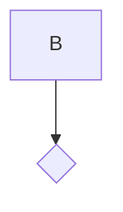

=== Content from github.com_3f345da5_20250119_111950.html ===

[Skip to content](#start-of-content)

## Navigation Menu

Toggle navigation

[Sign in](/login?return_to=https%3A%2F%2Fgithub.com%2Fhedgedoc%2Fhedgedoc%2Freleases%2Ftag%2F1.7.1)

* Product

  + [GitHub Copilot
    Write better code with AI](https://github.com/features/copilot)
  + [Security
    Find and fix vulnerabilities](https://github.com/features/security)
  + [Actions
    Automate any workflow](https://github.com/features/actions)
  + [Codespaces
    Instant dev environments](https://github.com/features/codespaces)
  + [Issues
    Plan and track work](https://github.com/features/issues)
  + [Code Review
    Manage code changes](https://github.com/features/code-review)
  + [Discussions
    Collaborate outside of code](https://github.com/features/discussions)
  + [Code Search
    Find more, search less](https://github.com/features/code-search)

  Explore
  + [All features](https://github.com/features)
  + [Documentation](https://docs.github.com)
  + [GitHub Skills](https://skills.github.com)
  + [Blog](https://github.blog)
* Solutions

  By company size
  + [Enterprises](https://github.com/enterprise)
  + [Small and medium teams](https://github.com/team)
  + [Startups](https://github.com/enterprise/startups)
  + [Nonprofits](/solutions/industry/nonprofits)
  By use case
  + [DevSecOps](/solutions/use-case/devsecops)
  + [DevOps](/solutions/use-case/devops)
  + [CI/CD](/solutions/use-case/ci-cd)
  + [View all use cases](/solutions/use-case)

  By industry
  + [Healthcare](/solutions/industry/healthcare)
  + [Financial services](/solutions/industry/financial-services)
  + [Manufacturing](/solutions/industry/manufacturing)
  + [Government](/solutions/industry/government)
  + [View all industries](/solutions/industry)

  [View all solutions](/solutions)
* Resources

  Topics
  + [AI](/resources/articles/ai)
  + [DevOps](/resources/articles/devops)
  + [Security](/resources/articles/security)
  + [Software Development](/resources/articles/software-development)
  + [View all](/resources/articles)

  Explore
  + [Learning Pathways](https://resources.github.com/learn/pathways)
  + [White papers, Ebooks, Webinars](https://resources.github.com)
  + [Customer Stories](https://github.com/customer-stories)
  + [Partners](https://partner.github.com)
  + [Executive Insights](https://github.com/solutions/executive-insights)
* Open Source

  + [GitHub Sponsors
    Fund open source developers](/sponsors)
  + [The ReadME Project
    GitHub community articles](https://github.com/readme)
  Repositories
  + [Topics](https://github.com/topics)
  + [Trending](https://github.com/trending)
  + [Collections](https://github.com/collections)
* Enterprise

  + [Enterprise platform
    AI-powered developer platform](/enterprise)
  Available add-ons
  + [Advanced Security
    Enterprise-grade security features](https://github.com/enterprise/advanced-security)
  + [GitHub Copilot
    Enterprise-grade AI features](/features/copilot#enterprise)
  + [Premium Support
    Enterprise-grade 24/7 support](/premium-support)
* [Pricing](https://github.com/pricing)

Search or jump to...

# Search code, repositories, users, issues, pull requests...

Search

Clear

[Search syntax tips](https://docs.github.com/search-github/github-code-search/understanding-github-code-search-syntax)

# Provide feedback

We read every piece of feedback, and take your input very seriously.

Include my email address so I can be contacted

  Cancel

 Submit feedback

# Saved searches

## Use saved searches to filter your results more quickly

Name

Query

To see all available qualifiers, see our [documentation](https://docs.github.com/search-github/github-code-search/understanding-github-code-search-syntax).

  Cancel

 Create saved search

[Sign in](/login?return_to=https%3A%2F%2Fgithub.com%2Fhedgedoc%2Fhedgedoc%2Freleases%2Ftag%2F1.7.1)

[Sign up](/signup?ref_cta=Sign+up&ref_loc=header+logged+out&ref_page=%2F%3Cuser-name%3E%2F%3Crepo-name%3E%2Freleases%2Fshow&source=header-repo&source_repo=hedgedoc%2Fhedgedoc)
Reseting focus

You signed in with another tab or window. Reload to refresh your session.
You signed out in another tab or window. Reload to refresh your session.
You switched accounts on another tab or window. Reload to refresh your session.

Dismiss alert

{{ message }}

[hedgedoc](/hedgedoc)
/
**[hedgedoc](/hedgedoc/hedgedoc)**
Public

* [Notifications](/login?return_to=%2Fhedgedoc%2Fhedgedoc) You must be signed in to change notification settings
* [Fork
  412](/login?return_to=%2Fhedgedoc%2Fhedgedoc)
* [Star
   5.4k](/login?return_to=%2Fhedgedoc%2Fhedgedoc)

* [Code](/hedgedoc/hedgedoc/tree/1.7.1)
* [Issues
  233](/hedgedoc/hedgedoc/issues)
* [Pull requests
  18](/hedgedoc/hedgedoc/pulls)
* [Actions](/hedgedoc/hedgedoc/actions)
* [Projects
  1](/hedgedoc/hedgedoc/projects)
* [Security](/hedgedoc/hedgedoc/security)
* [Insights](/hedgedoc/hedgedoc/pulse)

Additional navigation options

* [Code](/hedgedoc/hedgedoc/tree/1.7.1)
* [Issues](/hedgedoc/hedgedoc/issues)
* [Pull requests](/hedgedoc/hedgedoc/pulls)
* [Actions](/hedgedoc/hedgedoc/actions)
* [Projects](/hedgedoc/hedgedoc/projects)
* [Security](/hedgedoc/hedgedoc/security)
* [Insights](/hedgedoc/hedgedoc/pulse)

1. [Releases](/hedgedoc/hedgedoc/releases)
2. [1.7.1](/hedgedoc/hedgedoc/releases/tag/1.7.1)

# HedgeDoc 1.7.1

 Compare

Choose a tag to compare

Could not load tags

Nothing to show

[{{ refName }}
default](/hedgedoc/hedgedoc/compare/%7B%7B%20urlEncodedRefName%20%7D%7D...1.7.1)

 Loading

[View all tags](/hedgedoc/hedgedoc/tags)


[davidmehren](/davidmehren)
released this
27 Dec 21:12

·
[1569 commits](/hedgedoc/hedgedoc/compare/1.7.1...master)
to master
since this release

[1.7.1](/hedgedoc/hedgedoc/tree/1.7.1)

[`5b3d62e`](/hedgedoc/hedgedoc/commit/5b3d62e494c52309765da4b420516f00d49cb753)

This commit was signed with the committer’s **verified signature**.

[](/davidmehren)
[davidmehren](/davidmehren)
David Mehren

GPG key ID: 185982BA4C42B7C3

[Learn about vigilant mode](https://docs.github.com/github/authenticating-to-github/displaying-verification-statuses-for-all-of-your-commits).

This release fixes two security issues. We recommend upgrading as soon as possible.

## Security Fixes

* [CVE-2020-26286: Arbitrary file upload](https://github.com/hedgedoc/hedgedoc/security/advisories/GHSA-wcr3-xhv7-8gxc)

  An unauthenticated attacker can upload arbitrary files to the upload storage backend.
* [CVE-2020-26287: Stored XSS in mermaid diagrams](https://github.com/hedgedoc/hedgedoc/security/advisories/GHSA-g6w6-7xf9-m95p)

  An attacker can inject arbitrary script tags in HedgeDoc notes using mermaid diagrams.

 Assets
3

 Loading

All reactions

## Footer

© 2025 GitHub, Inc.

### Footer navigation

* [Terms](https://docs.github.com/site-policy/github-terms/github-terms-of-service)
* [Privacy](https://docs.github.com/site-policy/privacy-policies/github-privacy-statement)
* [Security](https://github.com/security)
* [Status](https://www.githubstatus.com/)
* [Docs](https://docs.github.com/)
* [Contact](https://support.github.com?tags=dotcom-footer)
* Manage cookies
* Do not share my personal information

You can’t perform that action at this time.


=== Content from community.hedgedoc.org_bc8afb5d_20250119_131338.html ===


Loading

[HedgeDoc Community](/)

| Topic |  | Replies | Views | Activity |
| --- | --- | --- | --- | --- |
| [Status of the demo instance](https://community.hedgedoc.org/t/status-of-the-demo-instance/1634)  [Community](/c/community/5)   Hello everyone, Maybe you have noticed that the demo instance got quite slow in the last time. We’re experiencing a huge increase in traffic. We’re not completely sure what is uploaded but it looks like some bots are m… |  | 15 | 19518 | October 2, 2024 |
| [Welcome to the HedgeDoc Community](https://community.hedgedoc.org/t/welcome-to-the-hedgedoc-community/8) |  | 1 | 4898 | March 31, 2019 |
| [OAuth2 - Mattermost - InternalOAuthError: Failed to obtain access token](https://community.hedgedoc.org/t/oauth2-mattermost-internaloautherror-failed-to-obtain-access-token/2178)  [Support](/c/support/6) |  | 1 | 34 | January 16, 2025 |
| [Unauthorized users and notes have appeared](https://community.hedgedoc.org/t/unauthorized-users-and-notes-have-appeared/2170)  [Support](/c/support/6) |  | 1 | 40 | January 9, 2025 |
| [SystemCallFilter in systemd service](https://community.hedgedoc.org/t/systemcallfilter-in-systemd-service/2165)  [Support](/c/support/6) |  | 0 | 71 | December 27, 2024 |
| [Custom oauth2 error auth access token unobtainable](https://community.hedgedoc.org/t/custom-oauth2-error-auth-access-token-unobtainable/2123)  [Support](/c/support/6) |  | 0 | 90 | December 18, 2024 |
| [How to tell Hedgedoc that it is run behind reverse proxy with SSL offloading?](https://community.hedgedoc.org/t/how-to-tell-hedgedoc-that-it-is-run-behind-reverse-proxy-with-ssl-offloading/2120)  [Support](/c/support/6) |  | 0 | 159 | December 13, 2024 |
| [How to disable message of the day (motd) HedgeDoc 2](https://community.hedgedoc.org/t/how-to-disable-message-of-the-day-motd-hedgedoc-2/2117)  [Feedback](/c/community/feedback/7) |  | 2 | 144 | December 6, 2024 |
| [How to configure with a file instead of environment variables](https://community.hedgedoc.org/t/how-to-configure-with-a-file-instead-of-environment-variables/1142)  [Support](/c/support/6) |  | 4 | 1096 | December 6, 2024 |
| [Is it safe to run SQL requests manually?](https://community.hedgedoc.org/t/is-it-safe-to-run-sql-requests-manually/2114)  [Support](/c/support/6) |  | 2 | 161 | December 2, 2024 |
| [Are/Will public notes be accessible without a link?](https://community.hedgedoc.org/t/are-will-public-notes-be-accessible-without-a-link/1932)  [Support](/c/support/6) |  | 1 | 450 | December 1, 2024 |
| [Issue Accessing HedgeDoc via Public URL with Cloudflare Tunnel](https://community.hedgedoc.org/t/issue-accessing-hedgedoc-via-public-url-with-cloudflare-tunnel/2058)  [Support](/c/support/6) |  | 1 | 318 | December 1, 2024 |
| [HTML export file is too big with less md file content](https://community.hedgedoc.org/t/html-export-file-is-too-big-with-less-md-file-content/2006)  [Feedback](/c/community/feedback/7) |  | 1 | 185 | December 1, 2024 |
| [Github Sync in Hedgedoc?](https://community.hedgedoc.org/t/github-sync-in-hedgedoc/385)  [Support](/c/support/6) |  | 3 | 2042 | November 30, 2024 |
| [Nextcloud OAuth2 callback does nothing](https://community.hedgedoc.org/t/nextcloud-oauth2-callback-does-nothing/1129)  [Support](/c/support/6) |  | 6 | 972 | November 27, 2024 |
| [Running codimd issues](https://community.hedgedoc.org/t/running-codimd-issues/106)  [Support](/c/support/6) |  | 7 | 2117 | November 17, 2024 |
| [Can't login by email with using a reverse proxy](https://community.hedgedoc.org/t/cant-login-by-email-with-using-a-reverse-proxy/1991)  [Support](/c/support/6) |  | 6 | 568 | October 15, 2024 |
| [Easy installer of HedgeDoc?](https://community.hedgedoc.org/t/easy-installer-of-hedgedoc/1942)  [Support](/c/support/6) |  | 2 | 464 | September 9, 2024 |
| [New HedgeDoc 1.x release?](https://community.hedgedoc.org/t/new-hedgedoc-1-x-release/1908)  [Support](/c/support/6) |  | 4 | 608 | September 4, 2024 |
| [Are notes automatically deleted in some cases?](https://community.hedgedoc.org/t/are-notes-automatically-deleted-in-some-cases/1931)  [Support](/c/support/6) |  | 1 | 405 | August 15, 2024 |
| [Slide and Presentation Mode](https://community.hedgedoc.org/t/slide-and-presentation-mode/1121)  [Feedback](/c/community/feedback/7) |  | 5 | 2483 | August 14, 2024 |
| [Using R2 Storage (Cloudflare) with the S3-Upload-Options](https://community.hedgedoc.org/t/using-r2-storage-cloudflare-with-the-s3-upload-options/975)  [Support](/c/support/6) |  | 2 | 1963 | August 5, 2024 |
| [Issues signing in with Google](https://community.hedgedoc.org/t/issues-signing-in-with-google/1915)  [Support](/c/support/6) |  | 0 | 378 | August 5, 2024 |
| [C# backend - is it viable?](https://community.hedgedoc.org/t/c-backend-is-it-viable/1906)  [Support](/c/support/6) |  | 1 | 388 | August 4, 2024 |
| [Hedgedoc api usage for updating existing pad](https://community.hedgedoc.org/t/hedgedoc-api-usage-for-updating-existing-pad/1902)  [Support](/c/support/6) |  | 1 | 458 | August 4, 2024 |
| [Maximum size reached](https://community.hedgedoc.org/t/maximum-size-reached/1667)  [Feedback](/c/community/feedback/7) |  | 4 | 543 | July 30, 2024 |
| [How to restore notes from the demo](https://community.hedgedoc.org/t/how-to-restore-notes-from-the-demo/1900)  [Support](/c/support/6) |  | 1 | 659 | July 23, 2024 |
| [Cloudflare response has changed using /download](https://community.hedgedoc.org/t/cloudflare-response-has-changed-using-download/1653)  [Support](/c/support/6) |  | 4 | 1984 | July 23, 2024 |
| [How to setup SSL with port other than 443](https://community.hedgedoc.org/t/how-to-setup-ssl-with-port-other-than-443/1454)  [Support](/c/support/6) |  | 1 | 817 | July 18, 2024 |
| [Is it possible to add directory to classify docs](https://community.hedgedoc.org/t/is-it-possible-to-add-directory-to-classify-docs/1322)  [Support](/c/support/6) |  | 2 | 2063 | April 29, 2024 |

**[next page →](/latest?no_definitions=true&page=1)**

* [Home](/)
* [Categories](/categories)
* [FAQ/Guidelines](/guidelines)
* [Terms of Service](/tos)
* [Privacy Policy](/privacy)

Powered by [Discourse](https://www.discourse.org), best viewed with JavaScript enabled


=== Content from github.com_af87f4a7_20250119_131341.html ===

[Skip to content](#start-of-content)

## Navigation Menu

Toggle navigation

[Sign in](/login?return_to=https%3A%2F%2Fgithub.com%2Fhackmdio%2Fcodimd%2Fissues%2F1630)

* Product

  + [GitHub Copilot
    Write better code with AI](https://github.com/features/copilot)
  + [Security
    Find and fix vulnerabilities](https://github.com/features/security)
  + [Actions
    Automate any workflow](https://github.com/features/actions)
  + [Codespaces
    Instant dev environments](https://github.com/features/codespaces)
  + [Issues
    Plan and track work](https://github.com/features/issues)
  + [Code Review
    Manage code changes](https://github.com/features/code-review)
  + [Discussions
    Collaborate outside of code](https://github.com/features/discussions)
  + [Code Search
    Find more, search less](https://github.com/features/code-search)

  Explore
  + [All features](https://github.com/features)
  + [Documentation](https://docs.github.com)
  + [GitHub Skills](https://skills.github.com)
  + [Blog](https://github.blog)
* Solutions

  By company size
  + [Enterprises](https://github.com/enterprise)
  + [Small and medium teams](https://github.com/team)
  + [Startups](https://github.com/enterprise/startups)
  + [Nonprofits](/solutions/industry/nonprofits)
  By use case
  + [DevSecOps](/solutions/use-case/devsecops)
  + [DevOps](/solutions/use-case/devops)
  + [CI/CD](/solutions/use-case/ci-cd)
  + [View all use cases](/solutions/use-case)

  By industry
  + [Healthcare](/solutions/industry/healthcare)
  + [Financial services](/solutions/industry/financial-services)
  + [Manufacturing](/solutions/industry/manufacturing)
  + [Government](/solutions/industry/government)
  + [View all industries](/solutions/industry)

  [View all solutions](/solutions)
* Resources

  Topics
  + [AI](/resources/articles/ai)
  + [DevOps](/resources/articles/devops)
  + [Security](/resources/articles/security)
  + [Software Development](/resources/articles/software-development)
  + [View all](/resources/articles)

  Explore
  + [Learning Pathways](https://resources.github.com/learn/pathways)
  + [White papers, Ebooks, Webinars](https://resources.github.com)
  + [Customer Stories](https://github.com/customer-stories)
  + [Partners](https://partner.github.com)
  + [Executive Insights](https://github.com/solutions/executive-insights)
* Open Source

  + [GitHub Sponsors
    Fund open source developers](/sponsors)
  + [The ReadME Project
    GitHub community articles](https://github.com/readme)
  Repositories
  + [Topics](https://github.com/topics)
  + [Trending](https://github.com/trending)
  + [Collections](https://github.com/collections)
* Enterprise

  + [Enterprise platform
    AI-powered developer platform](/enterprise)
  Available add-ons
  + [Advanced Security
    Enterprise-grade security features](https://github.com/enterprise/advanced-security)
  + [GitHub Copilot
    Enterprise-grade AI features](/features/copilot#enterprise)
  + [Premium Support
    Enterprise-grade 24/7 support](/premium-support)
* [Pricing](https://github.com/pricing)

Search or jump to...

# Search code, repositories, users, issues, pull requests...

Search

Clear

[Search syntax tips](https://docs.github.com/search-github/github-code-search/understanding-github-code-search-syntax)

# Provide feedback

We read every piece of feedback, and take your input very seriously.

Include my email address so I can be contacted

  Cancel

 Submit feedback

# Saved searches

## Use saved searches to filter your results more quickly

Name

Query

To see all available qualifiers, see our [documentation](https://docs.github.com/search-github/github-code-search/understanding-github-code-search-syntax).

  Cancel

 Create saved search

[Sign in](/login?return_to=https%3A%2F%2Fgithub.com%2Fhackmdio%2Fcodimd%2Fissues%2F1630)

[Sign up](/signup?ref_cta=Sign+up&ref_loc=header+logged+out&ref_page=%2F%3Cuser-name%3E%2F%3Crepo-name%3E%2Fvoltron%2Fissues_fragments%2Fissue_layout&source=header-repo&source_repo=hackmdio%2Fcodimd)
Reseting focus

You signed in with another tab or window. Reload to refresh your session.
You signed out in another tab or window. Reload to refresh your session.
You switched accounts on another tab or window. Reload to refresh your session.

Dismiss alert

{{ message }}

[hackmdio](/hackmdio)
/
**[codimd](/hackmdio/codimd)**
Public

* [Notifications](/login?return_to=%2Fhackmdio%2Fcodimd) You must be signed in to change notification settings
* [Fork
  1.1k](/login?return_to=%2Fhackmdio%2Fcodimd)
* [Star
   9.4k](/login?return_to=%2Fhackmdio%2Fcodimd)

* [Code](/hackmdio/codimd)
* [Issues
  315](/hackmdio/codimd/issues)
* [Pull requests
  15](/hackmdio/codimd/pulls)
* [Actions](/hackmdio/codimd/actions)
* [Wiki](/hackmdio/codimd/wiki)
* [Security](/hackmdio/codimd/security)
* [Insights](/hackmdio/codimd/pulse)

Additional navigation options

* [Code](/hackmdio/codimd)
* [Issues](/hackmdio/codimd/issues)
* [Pull requests](/hackmdio/codimd/pulls)
* [Actions](/hackmdio/codimd/actions)
* [Wiki](/hackmdio/codimd/wiki)
* [Security](/hackmdio/codimd/security)
* [Insights](/hackmdio/codimd/pulse)

# Stored XSS in mermaid #1630

[New issue](/login?return_to=)[Jump to bottom](#comment-composer-heading)Copy link[New issue](/login?return_to=)[Jump to bottom](#comment-composer-heading)Copy linkClosed[#1633](https://github.com/hackmdio/codimd/pull/1633)Closed[Stored XSS in mermaid](#top)#1630[#1633](https://github.com/hackmdio/codimd/pull/1633)Copy linkLabels[security](https://github.com/hackmdio/codimd/issues?q=state%3Aopen%20label%3A%22security%22)Milestone[2.3.0](https://github.com/hackmdio/codimd/milestone/29)
## Description

[Alemmi](https://github.com/Alemmi)opened [on Dec 20, 2020](https://github.com/hackmdio/codimd/issues/1630#issue-771710540)

Hi,

This weekend I played hxpctf, during competition there was a challenge called hackme. It was a Docker with codimd. My solution was unintended: I use google analytics to exploit a stored xss bug in mermaid.

Here is my [PoC](https://github.com/Alemmi/ctf-writeups/blob/main/hxpctf-2020/hackme/solution.md)

The bug seems to be known by the mermaid developers ([issue](https://github.com/mermaid-js/mermaid/issues/869)).

I tryed it on [hackmd.io](https://hackmd.io/) and it works, too.

Hope you can fix soon!

P.S. Now I'm going to reopen the issue in mermaid repository. This is also a duplicate, but the other issues are marked as "solved".

Thanks

Alessandro Mizzaro

## Metadata

### Assignees

No one assigned

### Labels

[security](https://github.com/hackmdio/codimd/issues?q=state%3Aopen%20label%3A%22security%22)
### Type

No type
### Projects

No projects
### Milestone

* [2.3.0](https://github.com/hackmdio/codimd/milestone/29)
### Relationships

None yet
### Development

No branches or pull requests
## Issue actions

## Footer

© 2025 GitHub, Inc.

### Footer navigation

* [Terms](https://docs.github.com/site-policy/github-terms/github-terms-of-service)
* [Privacy](https://docs.github.com/site-policy/privacy-policies/github-privacy-statement)
* [Security](https://github.com/security)
* [Status](https://www.githubstatus.com/)
* [Docs](https://docs.github.com/)
* [Contact](https://support.github.com?tags=dotcom-footer)
* Manage cookies
* Do not share my personal information

You can’t perform that action at this time.


=== Content from github.com_ebd7fa1e_20250119_111950.html ===

[Skip to content](#start-of-content)

## Navigation Menu

Toggle navigation

[Sign in](/login?return_to=https%3A%2F%2Fgithub.com%2Fhedgedoc%2Fhedgedoc%2Fcommit%2F58276ebbf4504a682454a3686dcaff88bc1069d4)

* Product

  + [GitHub Copilot
    Write better code with AI](https://github.com/features/copilot)
  + [Security
    Find and fix vulnerabilities](https://github.com/features/security)
  + [Actions
    Automate any workflow](https://github.com/features/actions)
  + [Codespaces
    Instant dev environments](https://github.com/features/codespaces)
  + [Issues
    Plan and track work](https://github.com/features/issues)
  + [Code Review
    Manage code changes](https://github.com/features/code-review)
  + [Discussions
    Collaborate outside of code](https://github.com/features/discussions)
  + [Code Search
    Find more, search less](https://github.com/features/code-search)

  Explore
  + [All features](https://github.com/features)
  + [Documentation](https://docs.github.com)
  + [GitHub Skills](https://skills.github.com)
  + [Blog](https://github.blog)
* Solutions

  By company size
  + [Enterprises](https://github.com/enterprise)
  + [Small and medium teams](https://github.com/team)
  + [Startups](https://github.com/enterprise/startups)
  + [Nonprofits](/solutions/industry/nonprofits)
  By use case
  + [DevSecOps](/solutions/use-case/devsecops)
  + [DevOps](/solutions/use-case/devops)
  + [CI/CD](/solutions/use-case/ci-cd)
  + [View all use cases](/solutions/use-case)

  By industry
  + [Healthcare](/solutions/industry/healthcare)
  + [Financial services](/solutions/industry/financial-services)
  + [Manufacturing](/solutions/industry/manufacturing)
  + [Government](/solutions/industry/government)
  + [View all industries](/solutions/industry)

  [View all solutions](/solutions)
* Resources

  Topics
  + [AI](/resources/articles/ai)
  + [DevOps](/resources/articles/devops)
  + [Security](/resources/articles/security)
  + [Software Development](/resources/articles/software-development)
  + [View all](/resources/articles)

  Explore
  + [Learning Pathways](https://resources.github.com/learn/pathways)
  + [White papers, Ebooks, Webinars](https://resources.github.com)
  + [Customer Stories](https://github.com/customer-stories)
  + [Partners](https://partner.github.com)
  + [Executive Insights](https://github.com/solutions/executive-insights)
* Open Source

  + [GitHub Sponsors
    Fund open source developers](/sponsors)
  + [The ReadME Project
    GitHub community articles](https://github.com/readme)
  Repositories
  + [Topics](https://github.com/topics)
  + [Trending](https://github.com/trending)
  + [Collections](https://github.com/collections)
* Enterprise

  + [Enterprise platform
    AI-powered developer platform](/enterprise)
  Available add-ons
  + [Advanced Security
    Enterprise-grade security features](https://github.com/enterprise/advanced-security)
  + [GitHub Copilot
    Enterprise-grade AI features](/features/copilot#enterprise)
  + [Premium Support
    Enterprise-grade 24/7 support](/premium-support)
* [Pricing](https://github.com/pricing)

Search or jump to...

# Search code, repositories, users, issues, pull requests...

Search

Clear

[Search syntax tips](https://docs.github.com/search-github/github-code-search/understanding-github-code-search-syntax)

# Provide feedback

We read every piece of feedback, and take your input very seriously.

Include my email address so I can be contacted

  Cancel

 Submit feedback

# Saved searches

## Use saved searches to filter your results more quickly

Name

Query

To see all available qualifiers, see our [documentation](https://docs.github.com/search-github/github-code-search/understanding-github-code-search-syntax).

  Cancel

 Create saved search

[Sign in](/login?return_to=https%3A%2F%2Fgithub.com%2Fhedgedoc%2Fhedgedoc%2Fcommit%2F58276ebbf4504a682454a3686dcaff88bc1069d4)

[Sign up](/signup?ref_cta=Sign+up&ref_loc=header+logged+out&ref_page=%2F%3Cuser-name%3E%2F%3Crepo-name%3E%2Fvoltron%2Fcommit_fragments%2Frepo_layout&source=header-repo&source_repo=hedgedoc%2Fhedgedoc)
Reseting focus

You signed in with another tab or window. Reload to refresh your session.
You signed out in another tab or window. Reload to refresh your session.
You switched accounts on another tab or window. Reload to refresh your session.

Dismiss alert

{{ message }}

[hedgedoc](/hedgedoc)
/
**[hedgedoc](/hedgedoc/hedgedoc)**
Public

* [Notifications](/login?return_to=%2Fhedgedoc%2Fhedgedoc) You must be signed in to change notification settings
* [Fork
  412](/login?return_to=%2Fhedgedoc%2Fhedgedoc)
* [Star
   5.4k](/login?return_to=%2Fhedgedoc%2Fhedgedoc)

* [Code](/hedgedoc/hedgedoc)
* [Issues
  233](/hedgedoc/hedgedoc/issues)
* [Pull requests
  18](/hedgedoc/hedgedoc/pulls)
* [Actions](/hedgedoc/hedgedoc/actions)
* [Projects
  1](/hedgedoc/hedgedoc/projects)
* [Security](/hedgedoc/hedgedoc/security)
* [Insights](/hedgedoc/hedgedoc/pulse)

Additional navigation options

* [Code](/hedgedoc/hedgedoc)
* [Issues](/hedgedoc/hedgedoc/issues)
* [Pull requests](/hedgedoc/hedgedoc/pulls)
* [Actions](/hedgedoc/hedgedoc/actions)
* [Projects](/hedgedoc/hedgedoc/projects)
* [Security](/hedgedoc/hedgedoc/security)
* [Insights](/hedgedoc/hedgedoc/pulse)

## Commit

[Permalink](/hedgedoc/hedgedoc/commit/58276ebbf4504a682454a3686dcaff88bc1069d4)

This commit does not belong to any branch on this repository, and may belong to a fork outside of the repository.

Merge pull request from [GHSA-g6w6-7xf9-m95p](https://github.com/hedgedoc/hedgedoc/security/advisories/GHSA-g6w6-7xf9-m95p "GHSA-g6w6-7xf9-m95p")

[Browse files](/hedgedoc/hedgedoc/tree/58276ebbf4504a682454a3686dcaff88bc1069d4)
Browse the repository at this point in the history

```
Don't store mermaid diagrams in innerHTML
```

* Loading branch information

[](/davidmehren)

[davidmehren](/hedgedoc/hedgedoc/commits?author=davidmehren "View all commits by davidmehren")
authored
Dec 27, 2020

2 parents
[b23035c](/hedgedoc/hedgedoc/commit/b23035c9a864eaa5efaa0423f1bab323ee0f8022)
+
[c32b1cf](/hedgedoc/hedgedoc/commit/c32b1cf42b8ec96571815efc4a22a2207519807d)

commit 58276eb

Showing
**1 changed file**
with
**1 addition**
and
**1 deletion**.

* Whitespace
* Ignore whitespace

* Split
* Unified

## There are no files selected for viewing

2 changes: 1 addition & 1 deletion

2
[public/js/extra.js](#diff-2ad043d341536abb8333f0fe7772c8677c90e4ef371eabea544b3da2f12e251b "public/js/extra.js")

Show comments

[View file](/hedgedoc/hedgedoc/blob/58276ebbf4504a682454a3686dcaff88bc1069d4/public/js/extra.js)
Edit file

Delete file

This file contains bidirectional Unicode text that may be interpreted or compiled differently than what appears below. To review, open the file in an editor that reveals hidden Unicode characters.
[Learn more about bidirectional Unicode characters](https://github.co/hiddenchars)

  [Show hidden characters](%7B%7B%20revealButtonHref%20%7D%7D)

| Original file line number | Diff line number | Diff line change |
| --- | --- | --- |
| Expand Up | | @@ -386,7 +386,7 @@ export function finishView (view) { |
|  |  |  |
|  |  | window.mermaid.mermaidAPI.parse($value.text()) |
|  |  | $ele.addClass('mermaid') |
|  |  | $ele.html($value.text()) |
|  |  | $ele.text($value.text()) |
|  |  | window.mermaid.init(undefined, $ele) |
|  |  | } catch (err) { |
|  |  | var errormessage = err |
| Expand Down | |  |

Toggle all file notes
Toggle all file annotations

### 0 comments on commit `58276eb`

Please
[sign in](/login?return_to=https%3A%2F%2Fgithub.com%2Fhedgedoc%2Fhedgedoc%2Fcommit%2F58276ebbf4504a682454a3686dcaff88bc1069d4) to comment.

## Footer

© 2025 GitHub, Inc.

### Footer navigation

* [Terms](https://docs.github.com/site-policy/github-terms/github-terms-of-service)
* [Privacy](https://docs.github.com/site-policy/privacy-policies/github-privacy-statement)
* [Security](https://github.com/security)
* [Status](https://www.githubstatus.com/)
* [Docs](https://docs.github.com/)
* [Contact](https://support.github.com?tags=dotcom-footer)
* Manage cookies
* Do not share my personal information

You can’t perform that action at this time.


=== Content from avatars.githubusercontent.com_ae2a00e2_20250119_131339.html ===
����� 

 $.' ",#(7),01444'9=82<.342 
2!!22222222222222222222222222222222222222222222222222��(("���
}!1AQa"q2���#B��R��$3br�
%&'()\*456789:CDEFGHIJSTUVWXYZcdefghijstuvwxyz�������������������������������������������������������������������������
w!1AQaq"2�B���� #3R�br�
$4�%�&'()\*56789:CDEFGHIJSTUVWXYZcdefghijstuvwxyz��������������������������������������������������������������������������?�m�O�P�E�
,��$�8a��z�\_�J���a-��-�F���9����~5��l�®�ؤ �W��#�?[��,�M"��+y�b��3�A���C��}+Rk\_j9��%si�J����\Z��?J�����qr�o[T�ɪ\_�g7P�W��YT�e�㿶k�����)�� �)b#�7O�|�� n�46��]K\*�AS"�G�z���ˢ�\_P�x������+;s��W���kƚO�I!s0v
��������i�z��ܘ�Hg�+3)+���q����2����T2L��Da��'��r@���Q�[��!$d�!&{M���3j�Hò�`�?�g������������ż��j�^ϴ�����Ջ}��.<�.�du9��5�i~�K]��Ƿq���X����Z�����{������
������4�ƑZKB���)����+��֯y�[��đʸ� �C�����q�^��C�V\_���ҮD�֯�m[U��I�cs��4/ӿ�Yi��zI�}S[���ZJ����

=== Content from github.com_e7da0cfe_20250119_111949.html ===

[Skip to content](#start-of-content)

## Navigation Menu

Toggle navigation

[Sign in](/login?return_to=https%3A%2F%2Fgithub.com%2FAlemmi%2Fctf-writeups%2Fblob%2Fmain%2Fhxpctf-2020%2Fhackme%2Fsolution.md)

* Product

  + [GitHub Copilot
    Write better code with AI](https://github.com/features/copilot)
  + [Security
    Find and fix vulnerabilities](https://github.com/features/security)
  + [Actions
    Automate any workflow](https://github.com/features/actions)
  + [Codespaces
    Instant dev environments](https://github.com/features/codespaces)
  + [Issues
    Plan and track work](https://github.com/features/issues)
  + [Code Review
    Manage code changes](https://github.com/features/code-review)
  + [Discussions
    Collaborate outside of code](https://github.com/features/discussions)
  + [Code Search
    Find more, search less](https://github.com/features/code-search)

  Explore
  + [All features](https://github.com/features)
  + [Documentation](https://docs.github.com)
  + [GitHub Skills](https://skills.github.com)
  + [Blog](https://github.blog)
* Solutions

  By company size
  + [Enterprises](https://github.com/enterprise)
  + [Small and medium teams](https://github.com/team)
  + [Startups](https://github.com/enterprise/startups)
  + [Nonprofits](/solutions/industry/nonprofits)
  By use case
  + [DevSecOps](/solutions/use-case/devsecops)
  + [DevOps](/solutions/use-case/devops)
  + [CI/CD](/solutions/use-case/ci-cd)
  + [View all use cases](/solutions/use-case)

  By industry
  + [Healthcare](/solutions/industry/healthcare)
  + [Financial services](/solutions/industry/financial-services)
  + [Manufacturing](/solutions/industry/manufacturing)
  + [Government](/solutions/industry/government)
  + [View all industries](/solutions/industry)

  [View all solutions](/solutions)
* Resources

  Topics
  + [AI](/resources/articles/ai)
  + [DevOps](/resources/articles/devops)
  + [Security](/resources/articles/security)
  + [Software Development](/resources/articles/software-development)
  + [View all](/resources/articles)

  Explore
  + [Learning Pathways](https://resources.github.com/learn/pathways)
  + [White papers, Ebooks, Webinars](https://resources.github.com)
  + [Customer Stories](https://github.com/customer-stories)
  + [Partners](https://partner.github.com)
  + [Executive Insights](https://github.com/solutions/executive-insights)
* Open Source

  + [GitHub Sponsors
    Fund open source developers](/sponsors)
  + [The ReadME Project
    GitHub community articles](https://github.com/readme)
  Repositories
  + [Topics](https://github.com/topics)
  + [Trending](https://github.com/trending)
  + [Collections](https://github.com/collections)
* Enterprise

  + [Enterprise platform
    AI-powered developer platform](/enterprise)
  Available add-ons
  + [Advanced Security
    Enterprise-grade security features](https://github.com/enterprise/advanced-security)
  + [GitHub Copilot
    Enterprise-grade AI features](/features/copilot#enterprise)
  + [Premium Support
    Enterprise-grade 24/7 support](/premium-support)
* [Pricing](https://github.com/pricing)

Search or jump to...

# Search code, repositories, users, issues, pull requests...

Search

Clear

[Search syntax tips](https://docs.github.com/search-github/github-code-search/understanding-github-code-search-syntax)

# Provide feedback

We read every piece of feedback, and take your input very seriously.

Include my email address so I can be contacted

  Cancel

 Submit feedback

# Saved searches

## Use saved searches to filter your results more quickly

Name

Query

To see all available qualifiers, see our [documentation](https://docs.github.com/search-github/github-code-search/understanding-github-code-search-syntax).

  Cancel

 Create saved search

[Sign in](/login?return_to=https%3A%2F%2Fgithub.com%2FAlemmi%2Fctf-writeups%2Fblob%2Fmain%2Fhxpctf-2020%2Fhackme%2Fsolution.md)

[Sign up](/signup?ref_cta=Sign+up&ref_loc=header+logged+out&ref_page=%2F%3Cuser-name%3E%2F%3Crepo-name%3E%2Fblob%2Fshow&source=header-repo&source_repo=Alemmi%2Fctf-writeups)
Reseting focus

You signed in with another tab or window. Reload to refresh your session.
You signed out in another tab or window. Reload to refresh your session.
You switched accounts on another tab or window. Reload to refresh your session.

Dismiss alert

{{ message }}

[Alemmi](/Alemmi)
/
**[ctf-writeups](/Alemmi/ctf-writeups)**
Public

* [Notifications](/login?return_to=%2FAlemmi%2Fctf-writeups) You must be signed in to change notification settings
* [Fork
  0](/login?return_to=%2FAlemmi%2Fctf-writeups)
* [Star
   1](/login?return_to=%2FAlemmi%2Fctf-writeups)

* [Code](/Alemmi/ctf-writeups)
* [Issues
  0](/Alemmi/ctf-writeups/issues)
* [Pull requests
  0](/Alemmi/ctf-writeups/pulls)
* [Actions](/Alemmi/ctf-writeups/actions)
* [Projects
  0](/Alemmi/ctf-writeups/projects)
* [Security](/Alemmi/ctf-writeups/security)
* [Insights](/Alemmi/ctf-writeups/pulse)

Additional navigation options

* [Code](/Alemmi/ctf-writeups)
* [Issues](/Alemmi/ctf-writeups/issues)
* [Pull requests](/Alemmi/ctf-writeups/pulls)
* [Actions](/Alemmi/ctf-writeups/actions)
* [Projects](/Alemmi/ctf-writeups/projects)
* [Security](/Alemmi/ctf-writeups/security)
* [Insights](/Alemmi/ctf-writeups/pulse)

## Files

 main
## Breadcrumbs

1. [ctf-writeups](/Alemmi/ctf-writeups/tree/main)
2. /[hxpctf-2020](/Alemmi/ctf-writeups/tree/main/hxpctf-2020)
3. /[hackme](/Alemmi/ctf-writeups/tree/main/hxpctf-2020/hackme)
/
# solution.md

Copy path Blame  Blame
## Latest commit

## History

[History](/Alemmi/ctf-writeups/commits/main/hxpctf-2020/hackme/solution.md)44 lines (35 loc) · 2.44 KB main
## Breadcrumbs

1. [ctf-writeups](/Alemmi/ctf-writeups/tree/main)
2. /[hxpctf-2020](/Alemmi/ctf-writeups/tree/main/hxpctf-2020)
3. /[hackme](/Alemmi/ctf-writeups/tree/main/hxpctf-2020/hackme)
/
# solution.md

Top
## File metadata and controls

* Preview
* Code
* Blame

44 lines (35 loc) · 2.44 KB[Raw](https://github.com/Alemmi/ctf-writeups/raw/refs/heads/main/hxpctf-2020/hackme/solution.md)
# Hackme: Web hard - hxpctf 2020

This year I played hxp ctf w/ [mHACKeroni](https://mhackeroni.it)

## The challenge

The challenge is a [CodiMD](https://github.com/hackmdio/codimd) docker with report uri.
In the challenge, a note called "the-flag" exists and it contents, obv, the fl4g. This challenge is very very intresting, I loved it but the Dockerfile is really B1GG, with my orrible network it took ~15 minutes for build ahahah.

(Solves: 15/1177, Fixed by CodiMD Team after issue [#1630](https://github.com/hackmdio/codimd/issues/1630), CVE-2020-26287)

## The bug

This challenge, obviously, has an XSS vuln mlmlmlml!

Oh sh1t there is a CSP. I took a couple of minutes to analyze it

```
Content-Security-Policy: default-src 'self';script-src 'self' vimeo.com https://gist.github.com www.slideshare.net https://query.yahooapis.com 'unsafe-eval' https://disqus.com https://*.disqus.com https://*.disquscdn.com https://www.google-analytics.com 'nonce-90dfe8a7-eaa5-41a5-a9f2-7d36a6db7ce3' 'sha256-81acLZNZISnyGYZrSuoYhpzwDTTxi7vC1YM4uNxqWaM=';img-src * data:;style-src 'self' 'unsafe-inline' https://github.githubassets.com https://*.disquscdn.com;font-src 'self' data: https://public.slidesharecdn.com https://*.disquscdn.com;object-src *;media-src *;child-src *;connect-src *

```

Eureka: `https://www.google-analytics.com` is enable.

But first I need a method to include some script from google analytics :(

With some osint I find a stored xss bug in [mermeid graph](https://github.com/mermaid-js/mermaid/issues/869).

## IT'S TIME TO EXPLOIT

With google analytics there is a service called "Google Tag Manager". With it I can create cusotm tag and custom javascript code.

First of all I write an XSS payload and create a variable in Google Tag Manager with this paylod.

[](/Alemmi/ctf-writeups/blob/main/hxpctf-2020/hackme/images/custom_javascript.png)

Secondly I create a custom Google Universal Analytics Tag ang Google Analytics Settigs that took the custom variable and do something at the page load event

[](/Alemmi/ctf-writeups/blob/main/hxpctf-2020/hackme/images/gas.png)

[](/Alemmi/ctf-writeups/blob/main/hxpctf-2020/hackme/images/gaua.png)

Finally I write a new note that trigger the xss bug:

```


And I report my note.

The flag:
`hxp{Yo dawg, I heard you like XSS, so I put some DOM injection in your script injection so you can inject scripts while you inject HTML while you inject scripts! Any questions?}`.

Thanks a lot to orgs for the idea and for the other challenges.

## Footer

© 2025 GitHub, Inc.

### Footer navigation

* [Terms](https://docs.github.com/site-policy/github-terms/github-terms-of-service)
* [Privacy](https://docs.github.com/site-policy/privacy-policies/github-privacy-statement)
* [Security](https://github.com/security)
* [Status](https://www.githubstatus.com/)
* [Docs](https://docs.github.com/)
* [Contact](https://support.github.com?tags=dotcom-footer)
* Manage cookies
* Do not share my personal information

You can’t perform that action at this time.


=== Content from github.com_918afa64_20250119_131337.html ===

[Skip to content](#start-of-content)

## Navigation Menu

Toggle navigation

[Sign in](/login?return_to=https%3A%2F%2Fgithub.com%2Fhedgedoc%2Fhedgedoc%2Fsecurity%2Fadvisories%2FGHSA-wcr3-xhv7-8gxc)

* Product

  + [GitHub Copilot
    Write better code with AI](https://github.com/features/copilot)
  + [Security
    Find and fix vulnerabilities](https://github.com/features/security)
  + [Actions
    Automate any workflow](https://github.com/features/actions)
  + [Codespaces
    Instant dev environments](https://github.com/features/codespaces)
  + [Issues
    Plan and track work](https://github.com/features/issues)
  + [Code Review
    Manage code changes](https://github.com/features/code-review)
  + [Discussions
    Collaborate outside of code](https://github.com/features/discussions)
  + [Code Search
    Find more, search less](https://github.com/features/code-search)

  Explore
  + [All features](https://github.com/features)
  + [Documentation](https://docs.github.com)
  + [GitHub Skills](https://skills.github.com)
  + [Blog](https://github.blog)
* Solutions

  By company size
  + [Enterprises](https://github.com/enterprise)
  + [Small and medium teams](https://github.com/team)
  + [Startups](https://github.com/enterprise/startups)
  + [Nonprofits](/solutions/industry/nonprofits)
  By use case
  + [DevSecOps](/solutions/use-case/devsecops)
  + [DevOps](/solutions/use-case/devops)
  + [CI/CD](/solutions/use-case/ci-cd)
  + [View all use cases](/solutions/use-case)

  By industry
  + [Healthcare](/solutions/industry/healthcare)
  + [Financial services](/solutions/industry/financial-services)
  + [Manufacturing](/solutions/industry/manufacturing)
  + [Government](/solutions/industry/government)
  + [View all industries](/solutions/industry)

  [View all solutions](/solutions)
* Resources

  Topics
  + [AI](/resources/articles/ai)
  + [DevOps](/resources/articles/devops)
  + [Security](/resources/articles/security)
  + [Software Development](/resources/articles/software-development)
  + [View all](/resources/articles)

  Explore
  + [Learning Pathways](https://resources.github.com/learn/pathways)
  + [White papers, Ebooks, Webinars](https://resources.github.com)
  + [Customer Stories](https://github.com/customer-stories)
  + [Partners](https://partner.github.com)
  + [Executive Insights](https://github.com/solutions/executive-insights)
* Open Source

  + [GitHub Sponsors
    Fund open source developers](/sponsors)
  + [The ReadME Project
    GitHub community articles](https://github.com/readme)
  Repositories
  + [Topics](https://github.com/topics)
  + [Trending](https://github.com/trending)
  + [Collections](https://github.com/collections)
* Enterprise

  + [Enterprise platform
    AI-powered developer platform](/enterprise)
  Available add-ons
  + [Advanced Security
    Enterprise-grade security features](https://github.com/enterprise/advanced-security)
  + [GitHub Copilot
    Enterprise-grade AI features](/features/copilot#enterprise)
  + [Premium Support
    Enterprise-grade 24/7 support](/premium-support)
* [Pricing](https://github.com/pricing)

Search or jump to...

# Search code, repositories, users, issues, pull requests...

Search

Clear

[Search syntax tips](https://docs.github.com/search-github/github-code-search/understanding-github-code-search-syntax)

# Provide feedback

We read every piece of feedback, and take your input very seriously.

Include my email address so I can be contacted

  Cancel

 Submit feedback

# Saved searches

## Use saved searches to filter your results more quickly

Name

Query

To see all available qualifiers, see our [documentation](https://docs.github.com/search-github/github-code-search/understanding-github-code-search-syntax).

  Cancel

 Create saved search

[Sign in](/login?return_to=https%3A%2F%2Fgithub.com%2Fhedgedoc%2Fhedgedoc%2Fsecurity%2Fadvisories%2FGHSA-wcr3-xhv7-8gxc)

[Sign up](/signup?ref_cta=Sign+up&ref_loc=header+logged+out&ref_page=%2F%3Cuser-name%3E%2F%3Crepo-name%3E%2Frepos%2Fadvisories%2Fshow&source=header-repo&source_repo=hedgedoc%2Fhedgedoc)
Reseting focus

You signed in with another tab or window. Reload to refresh your session.
You signed out in another tab or window. Reload to refresh your session.
You switched accounts on another tab or window. Reload to refresh your session.

Dismiss alert

{{ message }}

[hedgedoc](/hedgedoc)
/
**[hedgedoc](/hedgedoc/hedgedoc)**
Public

* [Notifications](/login?return_to=%2Fhedgedoc%2Fhedgedoc) You must be signed in to change notification settings
* [Fork
  412](/login?return_to=%2Fhedgedoc%2Fhedgedoc)
* [Star
   5.4k](/login?return_to=%2Fhedgedoc%2Fhedgedoc)

* [Code](/hedgedoc/hedgedoc)
* [Issues
  233](/hedgedoc/hedgedoc/issues)
* [Pull requests
  18](/hedgedoc/hedgedoc/pulls)
* [Actions](/hedgedoc/hedgedoc/actions)
* [Projects
  1](/hedgedoc/hedgedoc/projects)
* [Security](/hedgedoc/hedgedoc/security)
* [Insights](/hedgedoc/hedgedoc/pulse)

Additional navigation options

* [Code](/hedgedoc/hedgedoc)
* [Issues](/hedgedoc/hedgedoc/issues)
* [Pull requests](/hedgedoc/hedgedoc/pulls)
* [Actions](/hedgedoc/hedgedoc/actions)
* [Projects](/hedgedoc/hedgedoc/projects)
* [Security](/hedgedoc/hedgedoc/security)
* [Insights](/hedgedoc/hedgedoc/pulse)

# Arbitrary file upload

High

[davidmehren](/davidmehren)
published
GHSA-wcr3-xhv7-8gxc
Dec 27, 2020

## Package

No package listed

## Affected versions

<1.7.1

## Patched versions

1.7.1

## Description

### Impact

An unauthenticated attacker can upload arbitrary files to the upload storage backend including HTML, JS and PHP (see note below) files.

Affected are all versions prior 1.7.1 or commit 90451b7b9380b349c92aa18ade0e2682a6dd2c7a.

### Patches

The problem is patched in HedgeDoc 1.7.1. You should however verify that your uploaded file storage only contains files that are allowed, as uploaded files might still be served.

### Workarounds

As workaround it's possible to block the `/uploadimage` endpoint on your instance using your reverse proxy. And/or restrict MIME-types and file names served from your upload file storage.

### For more information

If you have any questions or comments about this advisory:

* Open an topic on [our community forum](https://community.hedgedoc.org)
* Join our [matrix room](https://chat.hedgedoc.org)

### Credits

Credits go to T. Lambertz who discovered this vulnerability.

### Note on PHP and other CGI renderer for webservers

If the uploaded files are directly served by a webserver that interprets code, such as quite common LAMP installations, this exploit maybe allows to run arbitrary code on your backend. This would increase the rating of this vulnerability to critical. But as such a configuration was never advised and is only a theoretical construct at our current knowledge for deployments in the wild, it was ignored as part of the score calculation.

### Severity

High

### CVE ID

CVE-2020-26286

### Weaknesses

No CWEs

### Credits

* [](/tlambertz)
  [tlambertz](/tlambertz)
  Analyst

## Footer

© 2025 GitHub, Inc.

### Footer navigation

* [Terms](https://docs.github.com/site-policy/github-terms/github-terms-of-service)
* [Privacy](https://docs.github.com/site-policy/privacy-policies/github-privacy-statement)
* [Security](https://github.com/security)
* [Status](https://www.githubstatus.com/)
* [Docs](https://docs.github.com/)
* [Contact](https://support.github.com?tags=dotcom-footer)
* Manage cookies
* Do not share my personal information

You can’t perform that action at this time.


=== Content from chat.hedgedoc.org_f89ea9e0_20250119_131340.html ===


# Please enable javascript

Matrix.to is a preview service from chat rooms, people and communities on [Matrix](https://matrix.org).

It preserves your privacy by only processing what you view on the client side. For this to work, it needs javascript.


=== Content from github.com_abf3e0dd_20250119_131336.html ===

[Skip to content](#start-of-content)

## Navigation Menu

Toggle navigation

[Sign in](/login?return_to=https%3A%2F%2Fgithub.com%2Fhedgedoc%2Fhedgedoc%2Fsecurity%2Fadvisories%2FGHSA-g6w6-7xf9-m95p)

* Product

  + [GitHub Copilot
    Write better code with AI](https://github.com/features/copilot)
  + [Security
    Find and fix vulnerabilities](https://github.com/features/security)
  + [Actions
    Automate any workflow](https://github.com/features/actions)
  + [Codespaces
    Instant dev environments](https://github.com/features/codespaces)
  + [Issues
    Plan and track work](https://github.com/features/issues)
  + [Code Review
    Manage code changes](https://github.com/features/code-review)
  + [Discussions
    Collaborate outside of code](https://github.com/features/discussions)
  + [Code Search
    Find more, search less](https://github.com/features/code-search)

  Explore
  + [All features](https://github.com/features)
  + [Documentation](https://docs.github.com)
  + [GitHub Skills](https://skills.github.com)
  + [Blog](https://github.blog)
* Solutions

  By company size
  + [Enterprises](https://github.com/enterprise)
  + [Small and medium teams](https://github.com/team)
  + [Startups](https://github.com/enterprise/startups)
  + [Nonprofits](/solutions/industry/nonprofits)
  By use case
  + [DevSecOps](/solutions/use-case/devsecops)
  + [DevOps](/solutions/use-case/devops)
  + [CI/CD](/solutions/use-case/ci-cd)
  + [View all use cases](/solutions/use-case)

  By industry
  + [Healthcare](/solutions/industry/healthcare)
  + [Financial services](/solutions/industry/financial-services)
  + [Manufacturing](/solutions/industry/manufacturing)
  + [Government](/solutions/industry/government)
  + [View all industries](/solutions/industry)

  [View all solutions](/solutions)
* Resources

  Topics
  + [AI](/resources/articles/ai)
  + [DevOps](/resources/articles/devops)
  + [Security](/resources/articles/security)
  + [Software Development](/resources/articles/software-development)
  + [View all](/resources/articles)

  Explore
  + [Learning Pathways](https://resources.github.com/learn/pathways)
  + [White papers, Ebooks, Webinars](https://resources.github.com)
  + [Customer Stories](https://github.com/customer-stories)
  + [Partners](https://partner.github.com)
  + [Executive Insights](https://github.com/solutions/executive-insights)
* Open Source

  + [GitHub Sponsors
    Fund open source developers](/sponsors)
  + [The ReadME Project
    GitHub community articles](https://github.com/readme)
  Repositories
  + [Topics](https://github.com/topics)
  + [Trending](https://github.com/trending)
  + [Collections](https://github.com/collections)
* Enterprise

  + [Enterprise platform
    AI-powered developer platform](/enterprise)
  Available add-ons
  + [Advanced Security
    Enterprise-grade security features](https://github.com/enterprise/advanced-security)
  + [GitHub Copilot
    Enterprise-grade AI features](/features/copilot#enterprise)
  + [Premium Support
    Enterprise-grade 24/7 support](/premium-support)
* [Pricing](https://github.com/pricing)

Search or jump to...

# Search code, repositories, users, issues, pull requests...

Search

Clear

[Search syntax tips](https://docs.github.com/search-github/github-code-search/understanding-github-code-search-syntax)

# Provide feedback

We read every piece of feedback, and take your input very seriously.

Include my email address so I can be contacted

  Cancel

 Submit feedback

# Saved searches

## Use saved searches to filter your results more quickly

Name

Query

To see all available qualifiers, see our [documentation](https://docs.github.com/search-github/github-code-search/understanding-github-code-search-syntax).

  Cancel

 Create saved search

[Sign in](/login?return_to=https%3A%2F%2Fgithub.com%2Fhedgedoc%2Fhedgedoc%2Fsecurity%2Fadvisories%2FGHSA-g6w6-7xf9-m95p)

[Sign up](/signup?ref_cta=Sign+up&ref_loc=header+logged+out&ref_page=%2F%3Cuser-name%3E%2F%3Crepo-name%3E%2Frepos%2Fadvisories%2Fshow&source=header-repo&source_repo=hedgedoc%2Fhedgedoc)
Reseting focus

You signed in with another tab or window. Reload to refresh your session.
You signed out in another tab or window. Reload to refresh your session.
You switched accounts on another tab or window. Reload to refresh your session.

Dismiss alert

{{ message }}

[hedgedoc](/hedgedoc)
/
**[hedgedoc](/hedgedoc/hedgedoc)**
Public

* [Notifications](/login?return_to=%2Fhedgedoc%2Fhedgedoc) You must be signed in to change notification settings
* [Fork
  412](/login?return_to=%2Fhedgedoc%2Fhedgedoc)
* [Star
   5.4k](/login?return_to=%2Fhedgedoc%2Fhedgedoc)

* [Code](/hedgedoc/hedgedoc)
* [Issues
  233](/hedgedoc/hedgedoc/issues)
* [Pull requests
  18](/hedgedoc/hedgedoc/pulls)
* [Actions](/hedgedoc/hedgedoc/actions)
* [Projects
  1](/hedgedoc/hedgedoc/projects)
* [Security](/hedgedoc/hedgedoc/security)
* [Insights](/hedgedoc/hedgedoc/pulse)

Additional navigation options

* [Code](/hedgedoc/hedgedoc)
* [Issues](/hedgedoc/hedgedoc/issues)
* [Pull requests](/hedgedoc/hedgedoc/pulls)
* [Actions](/hedgedoc/hedgedoc/actions)
* [Projects](/hedgedoc/hedgedoc/projects)
* [Security](/hedgedoc/hedgedoc/security)
* [Insights](/hedgedoc/hedgedoc/pulse)

# Stored XSS in mermaid diagrams

High

[davidmehren](/davidmehren)
published
GHSA-g6w6-7xf9-m95p
Dec 27, 2020

## Package

No package listed

## Affected versions

<1.7.1

## Patched versions

1.7.1

## Description

### Impact

An attacker can inject arbitrary `script` tags in HedgeDoc notes using mermaid diagrams. Our content security policy prevents loading scripts from most locations, but `www.google-analytics.com` is allowed. Using Google Tag Manger it is possible to inject arbitrary JavaScript and execute it on page load.

Depending on the configuration of the instance, the attacker may not need authentication to create or edit notes.

### Patches

The problem is patched in HedgeDoc 1.7.1.

### Workarounds

Disallow `www.google-analytics.com` in the `Content-Security-Policy` header. Note that other ways to leverage the `script` tag injection might exist.

### References

* This issue was discovered by [@Alemmi](https://github.com/Alemmi) and reported to hackmdio/codimd: [hackmdio/codimd#1630](https://github.com/hackmdio/codimd/issues/1630)
* CTF Writeup: <https://github.com/Alemmi/ctf-writeups/blob/main/hxpctf-2020/hackme/solution.md>

### For more information

If you have any questions or comments about this advisory:

* Open an topic on [our community forum](https://community.hedgedoc.org)
* Join our [matrix room](https://chat.hedgedoc.org)

### Severity

High

### CVE ID

CVE-2020-26287

### Weaknesses

No CWEs

### Credits

* [](/Alemmi)
  [Alemmi](/Alemmi)
  Analyst

## Footer

© 2025 GitHub, Inc.

### Footer navigation

* [Terms](https://docs.github.com/site-policy/github-terms/github-terms-of-service)
* [Privacy](https://docs.github.com/site-policy/privacy-policies/github-privacy-statement)
* [Security](https://github.com/security)
* [Status](https://www.githubstatus.com/)
* [Docs](https://docs.github.com/)
* [Contact](https://support.github.com?tags=dotcom-footer)
* Manage cookies
* Do not share my personal information

You can’t perform that action at this time.


