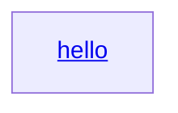

=== Content from github.com_b7fe372e_20250114_191023.html ===

[Skip to content](#start-of-content)

## Navigation Menu

Toggle navigation

[Sign in](/login?return_to=https%3A%2F%2Fgithub.com%2Flaurent22%2Fjoplin%2Fsecurity%2Fadvisories%2FGHSA-hff8-hjwv-j9q7)

* Product

  + [GitHub Copilot
    Write better code with AI](https://github.com/features/copilot)
  + [Security
    Find and fix vulnerabilities](https://github.com/features/security)
  + [Actions
    Automate any workflow](https://github.com/features/actions)
  + [Codespaces
    Instant dev environments](https://github.com/features/codespaces)
  + [Issues
    Plan and track work](https://github.com/features/issues)
  + [Code Review
    Manage code changes](https://github.com/features/code-review)
  + [Discussions
    Collaborate outside of code](https://github.com/features/discussions)
  + [Code Search
    Find more, search less](https://github.com/features/code-search)

  Explore
  + [All features](https://github.com/features)
  + [Documentation](https://docs.github.com)
  + [GitHub Skills](https://skills.github.com)
  + [Blog](https://github.blog)
* Solutions

  By company size
  + [Enterprises](https://github.com/enterprise)
  + [Small and medium teams](https://github.com/team)
  + [Startups](https://github.com/enterprise/startups)
  By use case
  + [DevSecOps](/solutions/use-case/devsecops)
  + [DevOps](/solutions/use-case/devops)
  + [CI/CD](/solutions/use-case/ci-cd)
  + [View all use cases](/solutions/use-case)

  By industry
  + [Healthcare](/solutions/industry/healthcare)
  + [Financial services](/solutions/industry/financial-services)
  + [Manufacturing](/solutions/industry/manufacturing)
  + [Government](/solutions/industry/government)
  + [View all industries](/solutions/industry)

  [View all solutions](/solutions)
* Resources

  Topics
  + [AI](/resources/articles/ai)
  + [DevOps](/resources/articles/devops)
  + [Security](/resources/articles/security)
  + [Software Development](/resources/articles/software-development)
  + [View all](/resources/articles)

  Explore
  + [Learning Pathways](https://resources.github.com/learn/pathways)
  + [White papers, Ebooks, Webinars](https://resources.github.com)
  + [Customer Stories](https://github.com/customer-stories)
  + [Partners](https://partner.github.com)
  + [Executive Insights](https://github.com/solutions/executive-insights)
* Open Source

  + [GitHub Sponsors
    Fund open source developers](/sponsors)
  + [The ReadME Project
    GitHub community articles](https://github.com/readme)
  Repositories
  + [Topics](https://github.com/topics)
  + [Trending](https://github.com/trending)
  + [Collections](https://github.com/collections)
* Enterprise

  + [Enterprise platform
    AI-powered developer platform](/enterprise)
  Available add-ons
  + [Advanced Security
    Enterprise-grade security features](https://github.com/enterprise/advanced-security)
  + [GitHub Copilot
    Enterprise-grade AI features](/features/copilot#enterprise)
  + [Premium Support
    Enterprise-grade 24/7 support](/premium-support)
* [Pricing](https://github.com/pricing)

Search or jump to...

# Search code, repositories, users, issues, pull requests...

Search

Clear

[Search syntax tips](https://docs.github.com/search-github/github-code-search/understanding-github-code-search-syntax)

# Provide feedback

We read every piece of feedback, and take your input very seriously.

Include my email address so I can be contacted

  Cancel

 Submit feedback

# Saved searches

## Use saved searches to filter your results more quickly

Name

Query

To see all available qualifiers, see our [documentation](https://docs.github.com/search-github/github-code-search/understanding-github-code-search-syntax).

  Cancel

 Create saved search

[Sign in](/login?return_to=https%3A%2F%2Fgithub.com%2Flaurent22%2Fjoplin%2Fsecurity%2Fadvisories%2FGHSA-hff8-hjwv-j9q7)

[Sign up](/signup?ref_cta=Sign+up&ref_loc=header+logged+out&ref_page=%2F%3Cuser-name%3E%2F%3Crepo-name%3E%2Frepos%2Fadvisories%2Fshow&source=header-repo&source_repo=laurent22%2Fjoplin)
Reseting focus

You signed in with another tab or window. Reload to refresh your session.
You signed out in another tab or window. Reload to refresh your session.
You switched accounts on another tab or window. Reload to refresh your session.

Dismiss alert

{{ message }}

[laurent22](/laurent22)
/
**[joplin](/laurent22/joplin)**
Public

* [Notifications](/login?return_to=%2Flaurent22%2Fjoplin) You must be signed in to change notification settings
* [Fork
  5.1k](/login?return_to=%2Flaurent22%2Fjoplin)
* [Star
   47.2k](/login?return_to=%2Flaurent22%2Fjoplin)

* [Code](/laurent22/joplin)
* [Issues
  439](/laurent22/joplin/issues)
* [Pull requests
  14](/laurent22/joplin/pulls)
* [Actions](/laurent22/joplin/actions)
* [Projects
  0](/laurent22/joplin/projects)
* [Security](/laurent22/joplin/security)
* [Insights](/laurent22/joplin/pulse)

Additional navigation options

* [Code](/laurent22/joplin)
* [Issues](/laurent22/joplin/issues)
* [Pull requests](/laurent22/joplin/pulls)
* [Actions](/laurent22/joplin/actions)
* [Projects](/laurent22/joplin/projects)
* [Security](/laurent22/joplin/security)
* [Insights](/laurent22/joplin/pulse)

# XSS on <a> Link in markdown preview

High

[laurent22](/laurent22)
published
GHSA-hff8-hjwv-j9q7
Nov 14, 2024

## Package

npm

joplin
([npm](/advisories?query=ecosystem%3Anpm))

## Affected versions

3.0

## Patched versions

3.1

## Description

Hi, Joplin developer team!

### Summary

We have discovered a vulnerability in `Joplin-desktop` that leads to remote code execution (RCE) when a user clicks on an `<a>` link within untrusted notes. The issue arises due to insufficient sanitization of `<a>` tag attributes introduced by the `Mermaid`. This vulnerability allows the execution of untrusted HTML content within the Electron window, which has full access to Node.js APIs, enabling arbitrary shell command execution.

### Details

In the markdown preview iframe, `Joplin` only opens `<a>` links internally within the same Electron window if they contain the `data-from-md` attribute. While Joplin successfully sanitizes the `data-from-md` attribute in user-embedded `<a>` links from the `.md` file to prevent the execution of untrusted HTML content, it fails to sanitize the `data-from-md` attributes of `<a>` tags introduced by `Mermaid` (e.g., the code snippet shown below). Since `Mermaid` allows the rendering of certain scriptless HTML elements, an attacker can embed `<a>` tags with `data-from-md` attributes, which will then be opened internally in the same Electron window.

Additionally, `Joplin` opens the window with `nodeIntegration` set to `true` and `contextIsolation` set to `false`, resulting in any scripts running in the opened window having full access to Node.js APIs. Furthermore, the markdown preview iframe shares the same origin (i.e.,local file system) as its parent and lacks the `sandbox` attribute, allowing scripts running in the iframe to call Node.js APIs through `window.parent`. As a result, an attacker can execute arbitrary code using Node.js APIs by exploiting HTML files stored on the local file system, which share the same origin as the parent.

**Relevant code references:**

* Payload to inject `<a>` with `data-from-md` attribute:

```

```

* Handling link navigation in the markdown preview iframe

[joplin/packages/lib/renderers/webviewLib.js](https://github.com/laurent22/joplin/blob/e6c09da639adeb76f12e4477cc8442c49c0ced0c/packages/lib/renderers/webviewLib.js#L93-L116)

Lines 93 to 116
in
[e6c09da](/laurent22/joplin/commit/e6c09da639adeb76f12e4477cc8442c49c0ced0c)

|  | document.addEventListener('click', (event) => { |
| --- | --- |
|  | const anchor = webviewLib.getParentAnchorElement(event.target); |
|  | if (!anchor) return; |
|  |  |
|  | // Prevent URLs added via <a> tags from being opened within the application itself |
|  | // otherwise it would open the whole website within the WebView. |
|  |  |
|  | // Note that we already handle some links in html\_inline.js, however not all of them |
|  | // go through this plugin, in particular links coming from third-party packages such |
|  | // as Katex or Mermaid. |
|  | if (!anchor.hasAttribute('data-from-md')) { |
|  | if (webviewLib.handleInternalLink(event, anchor)) return; |
|  | event.preventDefault(); |
|  | if (anchor.getAttribute('href')) webviewLib.options\_.postMessage(anchor.getAttribute('href')); |
|  | // Depending on the chart type, the generated SVG contains an anchor element with xlink:href attribute. |
|  | if (anchor.getAttribute('xlink:href')) webviewLib.options\_.postMessage(anchor.getAttribute('xlink:href')); |
|  | return; |
|  | } |
|  |  |
|  | // If this is an internal link, jump to the anchor directly |
|  | if (anchor.hasAttribute('data-from-md')) { |
|  | if (webviewLib.handleInternalLink(event, anchor)) return; |
|  | } |
|  | }); |

* Window configuration of `Joplin` window

[joplin/packages/app-desktop/ElectronAppWrapper.ts](https://github.com/laurent22/joplin/blob/e6c09da639adeb76f12e4477cc8442c49c0ced0c/packages/app-desktop/ElectronAppWrapper.ts#L141-L155)

Lines 141 to 155
in
[e6c09da](/laurent22/joplin/commit/e6c09da639adeb76f12e4477cc8442c49c0ced0c)

|  | const windowOptions: any = { |
| --- | --- |
|  | x: windowState.x, |
|  | y: windowState.y, |
|  | width: windowState.width, |
|  | height: windowState.height, |
|  | minWidth: 100, |
|  | minHeight: 100, |
|  | backgroundColor: '#fff', // required to enable sub pixel rendering, can't be in css |
|  | webPreferences: { |
|  | nodeIntegration: true, |
|  | contextIsolation: false, |
|  | spellcheck: true, |
|  | enableRemoteModule: true, |
|  | }, |
|  | webviewTag: true, |

### PoC

Considering the user has downloaded the following shared files from the internet (Note: the threat model aligns with existing published security issues: [GHSA-2h88-m32f-qh5m](https://github.com/laurent22/joplin/security/advisories/GHSA-2h88-m32f-qh5m) and [GHSA-g8qx-5vcm-3x59](https://github.com/laurent22/joplin/security/advisories/GHSA-g8qx-5vcm-3x59), where the malicious HTML file is available locally):

* `poc.md`

```

```

* `poc2.html`

```
<html>
  <body>
    <script>
      if (typeof window.parent.require !== 'undefined') {
        const { exec } = window.parent.require('child_process');
        exec('ls -al', (err, stdout, stderr) => {
          if (err) {
            document.body.innerText = `Error: ${err.message}`;
            return;
          }
          if (stderr) {
            document.body.innerText = `Stderr: ${stderr}`;
            return;
          }
          document.body.innerText = stdout;
        });
      } else {
        document.body.innerText = 'Require is not available in this environment.';
      }
    </script>
  </body>
</html>

```

Then, open the `poc.md` with `Joplin` and click on the `hello` link. The code embedded in the `poc2.html` will be executed.

[](https://private-user-images.githubusercontent.com/51242003/370890858-e85fbad8-a348-49cd-af51-4fc302dd6a8f.jpg?jwt=eyJhbGciOiJIUzI1NiIsInR5cCI6IkpXVCJ9.eyJpc3MiOiJnaXRodWIuY29tIiwiYXVkIjoicmF3LmdpdGh1YnVzZXJjb250ZW50LmNvbSIsImtleSI6ImtleTUiLCJleHAiOjE3MzY4ODIxMjIsIm5iZiI6MTczNjg4MTgyMiwicGF0aCI6Ii81MTI0MjAwMy8zNzA4OTA4NTgtZTg1ZmJhZDgtYTM0OC00OWNkLWFmNTEtNGZjMzAyZGQ2YThmLmpwZz9YLUFtei1BbGdvcml0aG09QVdTNC1ITUFDLVNIQTI1NiZYLUFtei1DcmVkZW50aWFsPUFLSUFWQ09EWUxTQTUzUFFLNFpBJTJGMjAyNTAxMTQlMkZ1cy1lYXN0LTElMkZzMyUyRmF3czRfcmVxdWVzdCZYLUFtei1EYXRlPTIwMjUwMTE0VDE5MTAyMlomWC1BbXotRXhwaXJlcz0zMDAmWC1BbXotU2lnbmF0dXJlPTcyZGY3NjE1YTRmNTdiMzZiOGEzNmE2ZTE0NTM1NTM4Mjk1NWIwNGEzMzQ2ZDRlYzdjZWMxN2Y1ZDExZGIwNTUmWC1BbXotU2lnbmVkSGVhZGVycz1ob3N0In0.4ZV2x_Uo3OFk4gIJPIKlIvPnwQHxSMYrfBMi2-boCTo)

### Impact

This vulnerability can lead to Remote Code Execution (RCE) when users open and interact with untrusted notes, while malicious HTML files are available locally.

### Severity

High

7.7

# CVSS overall score

 This score calculates overall vulnerability severity from 0 to 10 and is based on the Common Vulnerability Scoring System (CVSS).

 / 10

#### CVSS v3 base metrics

Attack vector
Local

Attack complexity
Low

Privileges required
High

User interaction
Required

Scope
Changed

Confidentiality
High

Integrity
High

Availability
Low

Learn more about base metrics

# CVSS v3 base metrics

Attack vector:
More severe the more the remote (logically and physically) an attacker can be in order to exploit the vulnerability.

Attack complexity:
More severe for the least complex attacks.

Privileges required:
More severe if no privileges are required.

User interaction:
More severe when no user interaction is required.

Scope:
More severe when a scope change occurs, e.g. one vulnerable component impacts resources in components beyond its security scope.

Confidentiality:
More severe when loss of data confidentiality is highest, measuring the level of data access available to an unauthorized user.

Integrity:
More severe when loss of data integrity is the highest, measuring the consequence of data modification possible by an unauthorized user.

Availability:
More severe when the loss of impacted component availability is highest.

CVSS:3.1/AV:L/AC:L/PR:H/UI:R/S:C/C:H/I:H/A:L

### CVE ID

CVE-2024-49362

### Weaknesses

[CWE-94](/advisories?query=cwe%3A94)

### Credits

* [](/jackfromeast)
  [jackfromeast](/jackfromeast)
  Reporter

## Footer

© 2025 GitHub, Inc.

### Footer navigation

* [Terms](https://docs.github.com/site-policy/github-terms/github-terms-of-service)
* [Privacy](https://docs.github.com/site-policy/privacy-policies/github-privacy-statement)
* [Security](https://github.com/security)
* [Status](https://www.githubstatus.com/)
* [Docs](https://docs.github.com/)
* [Contact](https://support.github.com?tags=dotcom-footer)
* Manage cookies
* Do not share my personal information

You can’t perform that action at this time.


